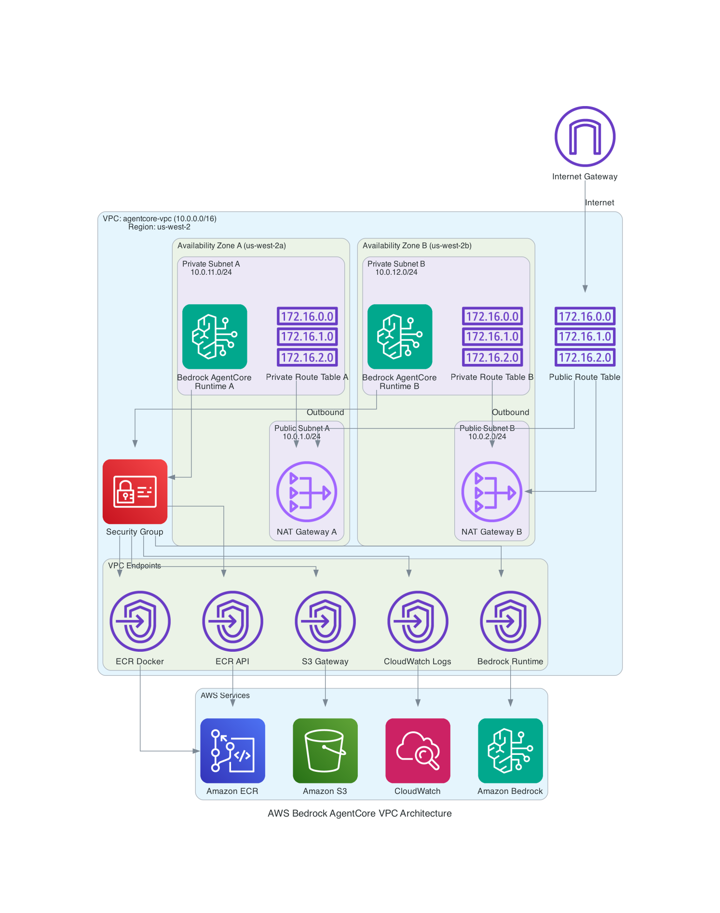

# A Demo of AgentCore Runtime in VPC with Internet Access
## [中文](README.md)
## 1. Network Architecture Description


1. Public Network
   - Internet Gateway (IGW): Provides connectivity to the internet
   - Public Route Table: Routes traffic to and from the internet through IGW

   - Availability Zone A (us-west-2a):
     * Public Subnet: 10.0.1.0/24
     * NAT Gateway: Provides outbound internet access for private subnets

   - Availability Zone B (us-west-2b):
     * Public Subnet: 10.0.2.0/24
     * NAT Gateway: Provides outbound internet access for private subnets

2. Private Network
   - Availability Zone A (us-west-2a):
     * Private Subnet: 10.0.11.0/24
     * Private Route Table: Routes outbound traffic through the NAT Gateway

   - Availability Zone B (us-west-2b):
     * Private Subnet: 10.0.12.0/24
     * Private Route Table: Routes outbound traffic through the NAT Gateway

3. Security
   - Bedrock Security Group: Controls traffic to and from Bedrock AgentCore

4. VPC Endpoints (Private Connections to AWS Services)
   - ECR Docker Endpoint (com.amazonaws.us-west-2.ecr.dkr)
   - ECR API Endpoint (com.amazonaws.us-west-2.ecr.api)
   - S3 Gateway Endpoint (com.amazonaws.us-west-2.s3)
   - CloudWatch Logs Endpoint (com.amazonaws.us-west-2.logs)
   - Bedrock Runtime Endpoint (com.amazonaws.us-west-2.bedrock-runtime)

5. Application
   - Bedrock AgentCore Runtime (deployed in private subnets)

Traffic Flow:
--------

1. Inbound Traffic
   Internet -> IGW -> Public Route Table -> Public Subnet

2. Outbound Traffic from Private Subnets
   Private Subnet -> Private Route Table -> NAT Gateway ->
   Public Subnet -> Public Route Table -> IGW -> Internet

3. Access to AWS Services
   Bedrock AgentCore -> Security Group -> VPC Endpoints -> AWS Services

High Availability:
--------
- Deployed across two availability zones for redundancy
- Each availability zone has its own NAT Gateway for fault tolerance
- Private subnets in each availability zone for application deployment

Security Features:
--------
- Private subnets isolate Bedrock AgentCore from direct internet access
- Security groups control all allowed traffic
- VPC endpoints provide private connections to AWS services
- NAT gateways only allow outbound internet access


## 2. Setup VPC and VPC Endpoints
1. Create VPC and Subnets
```bash
./setup-vpc.sh
```
This script will create the following resources:
```text
1 VPC (10.0.0.0/16)
1 Internet Gateway
4 Subnets (2 public subnets, 2 private subnets, across 2 availability zones)
2 Elastic IPs
2 NAT Gateways
3 Route Tables (1 public, 2 private)
1 Security Group (dedicated to Bedrock AgentCore runtime)
1 VPC Endpoint Node (Bedrock Runtime)
```

2. Create VPC Endpoints and Gateway
```bash
./setup-vpc-endpoints.sh
```
The above script will create the following resources:
```
ECR Docker Endpoint - For pulling Docker images
ECR API Endpoint - For ECR API calls
S3 Gateway Endpoint - For accessing S3 storage service
CloudWatch Logs Endpoint - For logging
Bedrock Endpoint - For accessing AWS Bedrock runtime service
```

## 3. Create IAM Execution Role
1. Run the script to create the role
```bash
./create_vpc_strands_agent_role.sh
```
This role will include BedrockAgentCoreFullAccess, AmazonBedrockFullAccess, ECR and other permissions for creating the runtime

## 4. Create ECR Repository and Deploy
### Deploying to ECR
1. Create an ECR repository:
```bash
aws ecr create-repository --repository-name vpc-strands-agent --region us-west-2
```
2. Log in to ECR:

```bash
aws ecr get-login-password --region us-west-2 | docker login --username AWS --password-stdin <account-id>.dkr.ecr.us-west-2.amazonaws.com
```
3. Build and push to ECR:

```bash
docker buildx build --platform linux/arm64 -t <account-id>.dkr.ecr.us-west-2.amazonaws.com/vpc-strands-agent:latest --push .
```
4. Verify the image was pushed:
```bash
aws ecr describe-images --repository-name vpc-strands-agent --region us-west-2
```


## 5. Deploy Agent Runtime
Modify the `deploy_agent.py` code, setting the subnets to the 2 private subnets created by the earlier script, and the security group to the security group created earlier.
```python
subnets = ['subnet-xxx', 'subnet-xxx']
sgs = ['sg-xxx']
```
Run `python deploy_agent.py`


## 6. Test Agent Runtime
Modify the `invoke_agent.py` code, setting the agentRuntimeArn to the actual ARN from the deployment.
Run `python invoke_agent.py`


## 7. Clean Up VPC Resources
```bash
./cleanup_vpc.sh
```