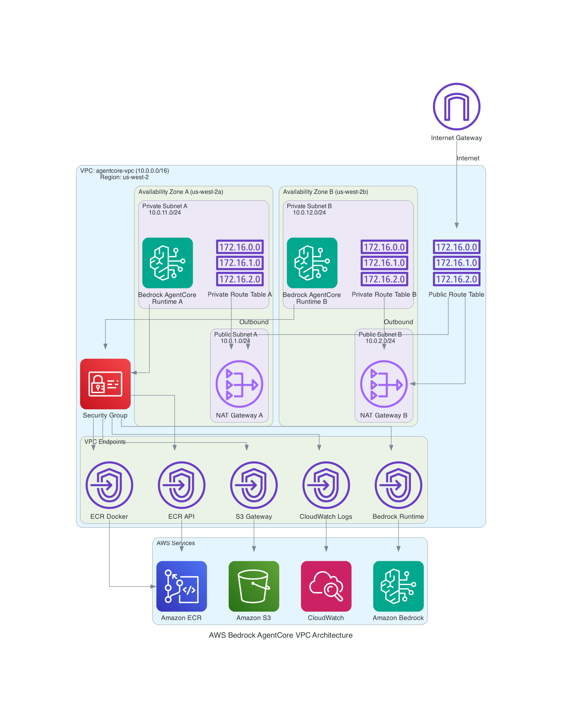

# A Demo of AgentCore runtime in VPC with Internet Access
## [English](README.en.md)
## 1.网络架构描述

1. 公有网络
   - 互联网网关 (IGW): 提供与互联网的连接
   - 公有路由表: 通过 IGW 路由进出互联网的流量

   - 可用区 A (us-west-2a):
     * 公有子网: 10.0.1.0/24
     * NAT 网关: 为私有子网提供出站互联网访问

   - 可用区 B (us-west-2b):
     * 公有子网: 10.0.2.0/24
     * NAT 网关: 为私有子网提供出站互联网访问

2. 私有网络
   - 可用区 A (us-west-2a):
     * 私有子网: 10.0.11.0/24
     * 私有路由表: 通过 NAT 网关路由出站流量

   - 可用区 B (us-west-2b):
     * 私有子网: 10.0.12.0/24
     * 私有路由表: 通过 NAT 网关路由出站流量

3. 安全
   - Bedrock 安全组: 控制进出 Bedrock AgentCore 的流量

4. VPC 端点 (连接到 AWS 服务的私有连接)
   - ECR Docker 端点 (com.amazonaws.us-west-2.ecr.dkr)
   - ECR API 端点 (com.amazonaws.us-west-2.ecr.api)
   - S3 网关端点 (com.amazonaws.us-west-2.s3)
   - CloudWatch 日志端点 (com.amazonaws.us-west-2.logs)
   - Bedrock 运行时端点 (com.amazonaws.us-west-2.bedrock-runtime)

5. 应用程序
   - Bedrock AgentCore 运行时 (部署在私有子网中)

流量流向:
--------

1. 入站流量
   互联网 -> IGW -> 公有路由表 -> 公有子网

2. 从私有子网的出站流量
   私有子网 -> 私有路由表 -> NAT 网关 ->
   公有子网 -> 公有路由表 -> IGW -> 互联网

3. 访问 AWS 服务
   Bedrock AgentCore -> 安全组 -> VPC 端点 -> AWS 服务

高可用性:
--------
- 跨两个可用区部署以实现冗余
- 每个可用区都有自己的 NAT 网关，以实现故障容错
- 每个可用区中的私有子网用于应用程序部署

安全特性:
--------
- 私有子网将 Bedrock AgentCore 与直接互联网访问隔离
- 安全组控制所有允许的流量
- VPC 端点提供与 AWS 服务的私有连接
- NAT 网关仅允许出站互联网访问


## 2. Setup VPC and VPC endpoints
1. 创建VPC和Subnets 
```bash
./setup-vpc.sh
```
这个脚本将创建资源：
```text
1个VPC（10.0.0.0/16）

1个互联网网关

4个子网（2个公有子网，2个私有子网，跨2个可用区）

2个弹性IP

2个NAT网关

3个路由表（1个公有，2个私有）

1个安全组（Bedrock AgentCore runtime专用）

1个VPC Endpoint节点（Bedrock Runtime）
```

2. 创建VPC Endpoint和Gateway
```bash
./setup-vpc-endpoints.sh
```
以上脚本将创建资源：
```
ECR Docker端点 - 用于拉取Docker镜像

ECR API端点 - 用于ECR API调用

S3 Gateway端点 - 用于访问S3存储服务

CloudWatch Logs端点 - 用于日志记录

Bedrock端点 - 用于访问AWS Bedrock运行时服务
```
## 3. 创建IAM execution role
1. 运行脚本创建role
```bash
./create_vpc_strands_agent_role.sh
```
这个role将包含BedrockAgentCoreFullAccess, AmazonBedrockFullAccess，ECR等权限用于后续创建runtime

## 4. Create ECR repository and deploy
### Deploying to ECR
1. Create an ECR repository:
```bash
aws ecr create-repository --repository-name vpc-strands-agent --region us-west-2
```
2. Log in to ECR:

```bash
aws ecr get-login-password --region us-west-2 | docker login --username AWS --password-stdin <account-id>.dkr.ecr.us-west-2.amazonaws.com
```
3. Build and push to ECR:

```bash
docker buildx build --platform linux/arm64 -t <account-id>.dkr.ecr.us-west-2.amazonaws.com/vpc-strands-agent:latest --push .
```
4. Verify the image was pushed:
```bash
aws ecr describe-images --repository-name vpc-strands-agent --region us-west-2
```


## 5.部署agent runtime
修改`deploy_agent.py`代码中的 subnets为前面脚本创建的2个私有子网，安全组为前面创建的安全组。 
```python 
subnets = ['subnet-xxx', 'subnet-xxx']
sgs = ['sg-xxx']
```
运行`python deploy_agent.py`


## 6.测试 agent runtime
修改`invoke_agent.py`代码中的 agentRuntimeArn 为前面deploy的实际arn。   
运行`python deploy_agent.py`


## 7.清理VPC资源
```bash
./cleanup_vpc.sh
```