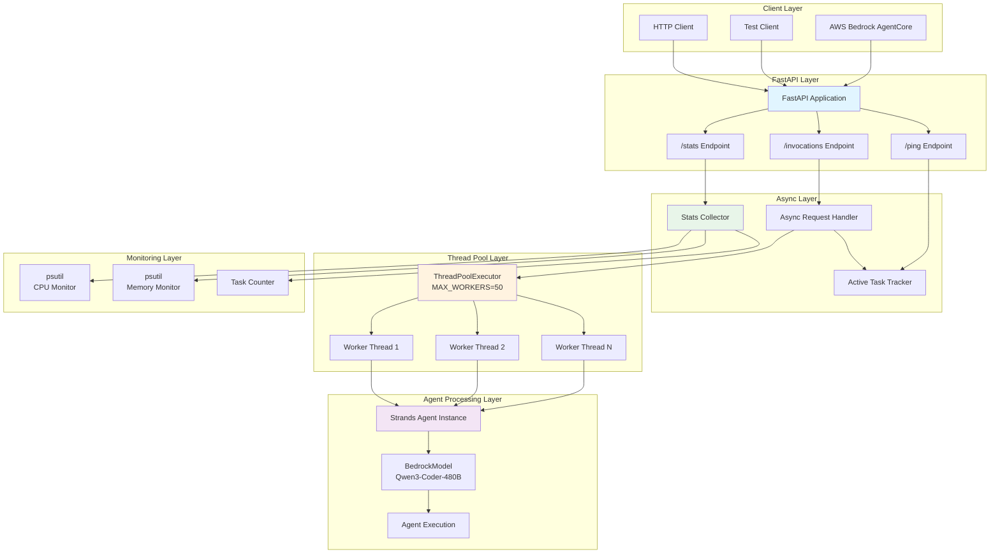
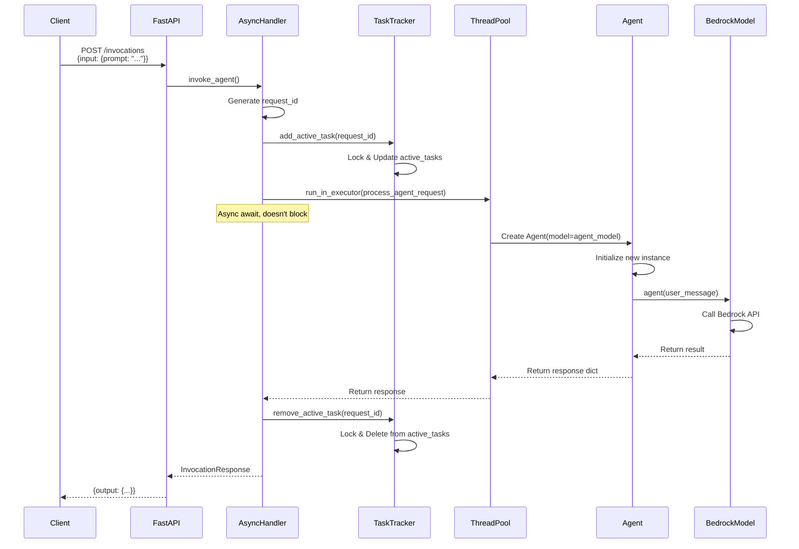
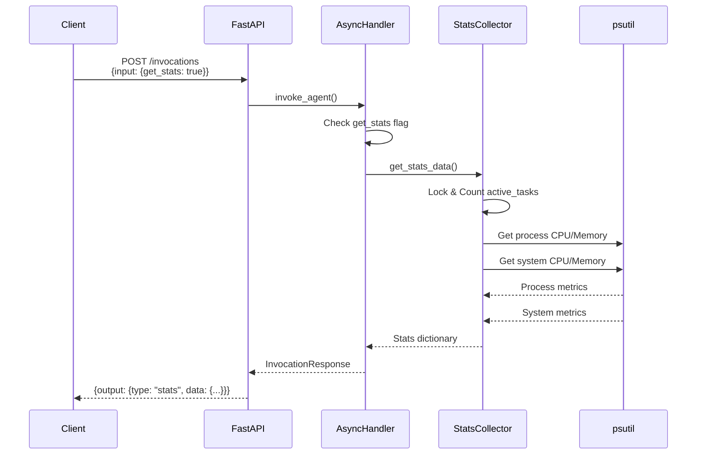
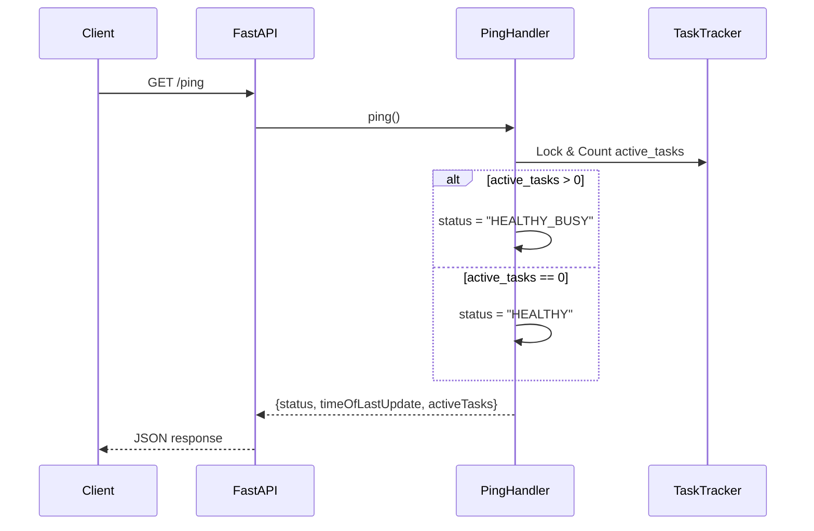

# AgentCore Runtime Architecture Documentation

## Overview

The `agent_entry.py` implements a high-performance, concurrent AgentCore Runtime server using FastAPI and ThreadPoolExecutor. It supports multiple concurrent agent requests with thread-safe task tracking, health monitoring, and system resource monitoring.

## Architecture Diagram



## Request Flow Diagram

### Normal Agent Request Flow



### Stats Request Flow



### Health Check Flow



## Component Architecture

### 1. Application Layer

```
┌─────────────────────────────────────────────┐
│         FastAPI Application                 │
│  - title: "Strands Agent Server"           │
│  - version: "1.0.0"                         │
│  - lifespan: Manages thread pool lifecycle │
└─────────────────────────────────────────────┘
```

**Key Features:**
- Lifespan context manager for startup/shutdown
- Automatic thread pool cleanup
- Logging configuration

### 2. Endpoint Layer

```
┌──────────────────────────────────────────────┐
│  POST /invocations                           │
│  - Agent processing requests                 │
│  - Stats requests (get_stats: true)          │
│  - Concurrent processing via thread pool     │
└──────────────────────────────────────────────┘

┌──────────────────────────────────────────────┐
│  GET /ping                                   │
│  - Health status: HEALTHY / HEALTHY_BUSY     │
│  - Active task count                         │
│  - Last update timestamp                     │
└──────────────────────────────────────────────┘

┌──────────────────────────────────────────────┐
│  GET /stats                                  │
│  - Thread pool statistics                    │
│  - CPU and memory usage                      │
│  - System resource metrics                   │
└──────────────────────────────────────────────┘
```

### 3. Concurrency Layer

```
┌─────────────────────────────────────────────┐
│      ThreadPoolExecutor                     │
│  - MAX_WORKERS: 50                          │
│  - Thread name prefix: "agent-worker"       │
│  - Shared across all requests               │
└─────────────────────────────────────────────┘

┌─────────────────────────────────────────────┐
│      Active Task Tracker                    │
│  - active_tasks: Dict[str, datetime]        │
│  - active_tasks_lock: asyncio.Lock()        │
│  - Thread-safe task management              │
└─────────────────────────────────────────────┘
```

### 4. Agent Processing Layer

```
┌─────────────────────────────────────────────┐
│   process_agent_request()                   │
│  - Runs in separate thread                  │
│  - Creates new Agent instance per request   │
│  - Ensures thread safety and isolation      │
└─────────────────────────────────────────────┘

┌─────────────────────────────────────────────┐
│   Strands Agent                             │
│  - Model: BedrockModel (Qwen3-Coder-480B)   │
│  - Dynamic model configuration              │
│  - Metrics tracking enabled                 │
└─────────────────────────────────────────────┘
```

## Data Models

### Request Model

```python
class InvocationRequest(BaseModel):
    input: Dict[str, Any]
    # Example:
    # {"prompt": "user message"}
    # OR
    # {"get_stats": true}
```

### Response Model

```python
class InvocationResponse(BaseModel):
    output: Dict[str, Any]
    # Example:
    # {
    #   "message": {...},
    #   "timestamp": "...",
    #   "request_id": "...",
    #   "metrics": {...},
    #   "status": "success"
    # }
```

## Threading Model

### Thread Safety Strategy

```
┌────────────────────────────────────────────────────┐
│  Main Event Loop (asyncio)                         │
│  - Handles HTTP requests asynchronously            │
│  - Non-blocking I/O operations                     │
│  - Submits CPU-bound work to thread pool           │
└────────────────────────────────────────────────────┘
                        │
                        ▼
┌────────────────────────────────────────────────────┐
│  Thread Pool Workers                               │
│  - Execute agent processing synchronously          │
│  - Each request gets isolated Agent instance       │
│  - No shared state between requests                │
└────────────────────────────────────────────────────┘
                        │
                        ▼
┌────────────────────────────────────────────────────┐
│  Strands Agent                                     │
│  - Process LLM requests                            │
│  - Call Bedrock API                                │
│  - Return results with metrics                     │
└────────────────────────────────────────────────────┘
```

### Lock Management

```python
# Active tasks tracking uses asyncio.Lock
async with active_tasks_lock:
    # Critical section: modify active_tasks dict
    active_tasks[request_id] = datetime.now(timezone.utc)
```

**Why asyncio.Lock?**
- Used by async coroutines (FastAPI endpoints)
- Prevents race conditions when updating active_tasks
- Lightweight for dict operations

## Request Lifecycle

### Complete Request Flow

```
1. Client Request
   └─> POST /invocations {"input": {"prompt": "..."}}

2. FastAPI Routing
   └─> invoke_agent() async handler

3. Request Validation
   ├─> Check if get_stats request → Return stats
   └─> Validate prompt exists

4. Model Initialization (if needed)
   └─> Create BedrockModel with configuration

5. Request ID Generation
   └─> timestamp-based unique ID

6. Task Tracking (Start)
   └─> add_active_task(request_id)
       └─> Lock → Update dict → Unlock

7. Thread Pool Submission
   └─> loop.run_in_executor(executor, process_func)
       ├─> Async await (doesn't block event loop)
       └─> Runs in thread pool worker

8. Agent Processing (In Thread)
   ├─> Create Agent(model=agent_model)
   ├─> agent(user_message)
   │   └─> Call Bedrock API
   │   └─> Get response + metrics
   └─> Return response dict

9. Response Return
   └─> Response flows back to async handler

10. Task Tracking (End)
    └─> remove_active_task(request_id) [in finally block]
        └─> Lock → Delete from dict → Unlock

11. Client Response
    └─> InvocationResponse(output={...})
```

## Monitoring Architecture

### Resource Monitoring Flow

```
┌──────────────────────────────────────────────┐
│  get_stats_data()                            │
└──────────────────────────────────────────────┘
          │
          ├─> Count Active Tasks
          │   └─> Lock active_tasks → len() → Unlock
          │
          ├─> Process Metrics (psutil)
          │   ├─> CPU percent (0.1s interval)
          │   ├─> Memory RSS (MB)
          │   ├─> Memory percent
          │   └─> Process ID
          │
          ├─> System Metrics (psutil)
          │   ├─> System CPU percent
          │   ├─> Total memory
          │   ├─> Used memory
          │   ├─> Available memory
          │   └─> Memory percent
          │
          └─> Thread Pool Stats
              ├─> MAX_WORKERS
              └─> Active thread count
```

### Health Status Logic

```
GET /ping
    │
    ├─> Lock active_tasks
    ├─> Count active_tasks
    │
    └─> if count > 0:
        │   status = "HEALTHY_BUSY"
        └─> else:
            status = "HEALTHY"
```

## Configuration

### Runtime Configuration

| Parameter | Default | Description |
|-----------|---------|-------------|
| `MAX_WORKERS` | 50 | Thread pool size |
| `MODEL_ID` | qwen.qwen3-coder-480b-a35b-v1:0 | Default model |
| `MAX_TOKENS` | 4096 | Max tokens per request |
| `TEMPERATURE` | 0.0 | Model temperature |
| `read_timeout` | 1800s | Bedrock API timeout |
| `connect_timeout` | 30s | Connection timeout |
| `max_attempts` | 3 | Retry attempts |

### Dynamic Configuration

The following can be configured per request via input:
- `model_id`: Override default model
- `max_tokens`: Override token limit
- `temperature`: Override temperature

Example:
```json
{
  "input": {
    "prompt": "...",
    "model_id": "custom-model",
    "max_tokens": 2048,
    "temperature": 0.7
  }
}
```

## Performance Characteristics

### Scalability

```
Concurrent Requests
    │
    ├─> Limited by MAX_WORKERS (50)
    ├─> Each request: ~1 Agent instance
    ├─> Memory: ~10-50MB per Agent
    └─> CPU: Depends on model and prompt
```

### Bottlenecks

1. **Thread Pool Size**
   - Max 50 concurrent requests
   - Additional requests queue

2. **Model API Latency**
   - Bedrock API call time
   - Network latency

3. **Memory**
   - Each Agent instance consumes memory
   - 50 concurrent = ~500MB-2.5GB

4. **CPU**
   - Depends on prompt complexity
   - System CPU vs process CPU

### Optimization Strategies

1. **Thread Pool Sizing**
   ```python
   # Tune based on:
   # - CPU cores available
   # - Memory available
   # - Model latency
   MAX_WORKERS = 50
   ```

2. **Request Isolation**
   - Each request gets new Agent instance
   - Prevents state contamination
   - Slightly higher memory overhead

3. **Async + Threads Hybrid**
   - FastAPI async for I/O
   - ThreadPool for CPU-bound work
   - Best of both worlds

## Error Handling

### Error Flow

```
Request Processing
    │
    ├─> HTTPException (400)
    │   └─> Missing prompt
    │
    ├─> HTTPException (500)
    │   └─> Agent processing error
    │       └─> Logged with request_id
    │
    └─> finally:
        └─> remove_active_task()
            └─> Guaranteed cleanup
```

### Cleanup Guarantee

```python
try:
    # Process request
    response = await loop.run_in_executor(...)
    return InvocationResponse(output=response)
finally:
    # ALWAYS executed, even on error
    await remove_active_task(request_id)
```

## Deployment Considerations

### Resource Requirements

| Metric | Minimum | Recommended |
|--------|---------|-------------|
| CPU Cores | 4 | 8+ |
| Memory | 4GB | 16GB+ |
| Network | 100Mbps | 1Gbps |

### Environment Variables

```bash
# Not currently used, but could be added:
export MAX_WORKERS=50
export MODEL_ID=qwen.qwen3-coder-480b-a35b-v1:0
export LOG_LEVEL=INFO
```

### Monitoring Integration

The architecture supports:
- Prometheus metrics export
- CloudWatch logs
- Custom monitoring via `/stats` endpoint

## Security Considerations

1. **Input Validation**
   - Pydantic models enforce schema
   - Prompt required for agent requests

2. **Error Information**
   - Detailed errors logged
   - Generic errors to client (500)

3. **Resource Limits**
   - MAX_WORKERS caps concurrency
   - Timeouts prevent hanging

4. **Isolation**
   - Each request isolated in thread
   - No shared Agent state

## Extension Points

### Adding New Endpoints

```python
@app.post("/custom-endpoint")
async def custom_handler(request: CustomRequest):
    # Use same pattern:
    # 1. Validate input
    # 2. Track task
    # 3. Submit to thread pool
    # 4. Return response
    pass
```

### Custom Monitoring

```python
async def get_custom_metrics():
    # Add custom metrics to stats
    stats = await get_stats_data()
    stats["custom_metric"] = calculate_custom()
    return stats
```

### Model Configuration

```python
# Add new model types
if model_id.startswith("claude"):
    model = AnthropicModel(...)
elif model_id.startswith("gpt"):
    model = OpenAIModel(...)
else:
    model = BedrockModel(...)
```

## Summary

The agent_entry.py architecture provides:

✅ **High Concurrency**: 50 parallel requests via thread pool
✅ **Thread Safety**: Asyncio locks for shared state
✅ **Isolation**: New Agent per request
✅ **Monitoring**: CPU, memory, task tracking
✅ **Health Checks**: HEALTHY/HEALTHY_BUSY status
✅ **Metrics**: Token usage, latency tracking
✅ **Error Handling**: Guaranteed cleanup
✅ **Flexibility**: Dynamic model configuration

This architecture is production-ready and scales well for AgentCore Runtime deployments.
