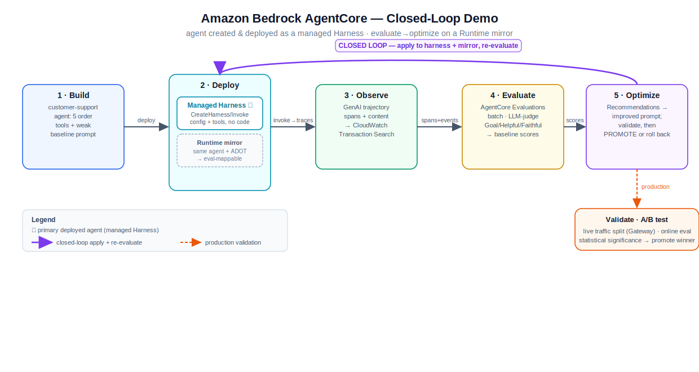

# AgentCore harness → evaluation → optimization: a closed-loop demo

> 🌐 Language: **English** · [简体中文](README.zh.md)

A simplified, hands-on demo that builds a **customer-support agent as a managed Amazon Bedrock
AgentCore Harness**, then uses **AgentCore Evaluations** and **AgentCore Optimization** to close
the **observe → evaluate → improve** loop — all on real AWS.



> 🇨🇳 **新手 / 想边学边做？** 看中文分步动手指南：[`docs/动手指南.md`](docs/动手指南.md) —— 每一步都讲清「为什么」「该看到什么」「会踩哪些坑」。

What it demonstrates, end to end:

1. **Create + deploy** the agent as a **managed AgentCore Harness** — model + a deliberately *weak*
   baseline system prompt + **5 inline-function tools** — via `CreateHarness`/`UpdateHarness`. No
   container, no orchestration code. Invoked through the `InvokeHarness` client-side tool loop.
2. **Evaluate** sessions with **AgentCore Evaluations** (batch, LLM-as-a-judge) → baseline scores.
3. **Optimize** with **AgentCore Recommendations** (analyze traces → improved prompt), apply it,
   re-evaluate, and **compare** — promoting only if it doesn't regress.
4. **Validate** in production with an **A/B test** (documented runbook).

> ⚠️ **Eval runs on a Runtime mirror, by necessity.** The managed harness is the agent you create,
> deploy, and invoke. But AgentCore Evaluations can't currently score the managed harness's
> telemetry (its Strands content events use a double-nested shape the evaluator rejects —
> `AgentSpanMappingException`). So the evaluate→optimize loop runs against a **Strands-on-Runtime
> mirror of the same agent** (same tools/prompt, ADOT-instrumented → eval-mappable), and any
> improvement is applied to **both**. Full explanation: [`docs/CONCEPTS.md`](docs/CONCEPTS.md) §2.

---

## Prerequisites

- An AWS account with **Amazon Bedrock Claude model access enabled** in `us-west-2`
  (the demo auto-picks the cheapest enabled Claude inference profile — Haiku 4.5).
- AWS credentials available to the default chain (env vars, `~/.aws`, SSO, …).
- [`uv`](https://docs.astral.sh/uv/) — manages the Python env (Python 3.12 is fetched automatically).
- The `agentcore` CLI ships with the `bedrock-agentcore-starter-toolkit` dependency (no npm needed).
- CloudWatch **Transaction Search** enabled (Evaluations reads traces); `preflight.py` checks/enables it.

---

## Reproduce it

```bash
# 0. Install deps (+ fetch Python 3.12) and verify prerequisites -> config.json
uv sync
uv run python preflight.py
uv run pytest -q                       # unit-test the deterministic tools

# 1. Deploy the agent as a managed Harness (model + weak prompt + 5 inline tools), and
#    deploy the Runtime mirror used for evaluation.
uv run python scripts/harness_create.py          # CreateHarness/UpdateHarness + warm invoke
uv run python scripts/invoke_deployed.py "ORD-1003 is really late, I want a discount."  # harness tool loop

export AGENTCORE_SUPPRESS_RECOMMENDATION=1
MODEL_ID=$(uv run python -c "import json;print(json.load(open('config.json'))['agent_model_id'])")
printf '\n\n\n\n' | uv run agentcore configure -e agent/main.py -n acmesupport -rf requirements.txt --disable-memory
printf '\n\n\n\n' | uv run agentcore deploy --env AGENT_MODEL_ID="$MODEL_ID" --env AGENT_OBSERVABILITY_ENABLED=true --auto-update-on-conflict
uv run python scripts/capture_deployment.py

# 2. Baseline evaluation (runtime mirror): generate sessions, wait for trace ingestion, score them
uv run python scripts/generate_sessions.py --tag baseline --target runtime --wait 200
uv run python scripts/run_evaluation.py --tag baseline

# 3. Optimize: recommend an improved prompt, apply to harness + prompts.py, redeploy mirror, re-eval, compare
uv run python scripts/run_optimization.py        # StartRecommendation + UpdateHarness
printf '\n\n\n\n' | uv run agentcore deploy --env AGENT_MODEL_ID="$MODEL_ID" --env AGENT_OBSERVABILITY_ENABLED=true --auto-update-on-conflict
uv run python scripts/generate_sessions.py --tag improved --target runtime --wait 200
uv run python scripts/run_evaluation.py --tag improved
uv run python scripts/compare.py                 # -> results/comparison.json (promote / do-not-promote)
uv run python scripts/ab_test.py                 # A/B-test runbook (production validation step)

# 4. Tear everything down to stop ongoing cost
uv run python scripts/teardown.py                # dry run
uv run python scripts/teardown.py --yes          # delete harness + runtime + eval/recommendation records
```

To run the harness *itself* through the eval scripts (and watch it fail with the documented
limitation), pass `--target harness` to `generate_sessions.py`.

### What the closed loop showed in this run (honest outcome)

The baseline scored `GoalSuccessRate = 1.0`, so the recommendation (no failures to learn from) added
a "wait for explicit approval before acting" safety invariant — which made the agent *ask* instead of
*completing* tasks, regressing `GoalSuccessRate` **1.0 → 0.6**. The evaluation **caught the
regression**, `compare.py` returned **`promote: false`**, and the change was **rolled back** to the
baseline prompt. That's the loop working as intended — it prevents a quality regression from shipping.
See `results/comparison.json`.

---

## Cost

Small (low single-digit dollars): Claude **Haiku 4.5**, short capped responses, ~10 sessions/round.
AgentCore Runtime + Harness are serverless / pay-per-use (idle cost negligible).
**Run `scripts/teardown.py --yes` when done.** For a fully clean account (IAM role, S3, ECR), also
run `agentcore destroy`.

---

## Troubleshooting

- **`preflight.py` says Bedrock access DISABLED** → enable an Anthropic Claude model in the Bedrock
  console (us-west-2 → *Model access*), wait for "Access granted", re-run.
- **Harness eval fails: `AgentSpanMappingException: Failed to parse user_query`** → expected for the
  managed harness (its content-event shape isn't mappable by Evaluations yet). Evaluate the Runtime
  mirror (`--target runtime`); see CONCEPTS §2.
- **Runtime batch eval fails all sessions** → the runtime agent must emit GenAI spans: ensure
  `aws-opentelemetry-distro` is in `requirements.txt` and `StrandsTelemetry().setup_otlp_exporter()`
  runs in `agent/main.py`, then redeploy. First-launch span indexing lags ~5–10 min.
- **`ValidationException` on `StartBatchEvaluation`** → `serviceNames` must be exactly one entry
  (`<agent-name>.DEFAULT` for runtime, `harness_<HarnessName>.DEFAULT` for harness); `batchEvaluationName`
  must match `[a-zA-Z][a-zA-Z0-9_]{0,47}`.
- **Harness tool `type` rejected** → use the snake_case enum `inline_function` (config key stays
  camelCase `inlineFunction`).
- **`agentcore configure` crashes on `/dev/null`** → it's interactive; pipe newlines (`printf '\n\n\n\n' | …`).

---

## Layout

```
agent/            orders.py (tool logic) · prompts.py (baseline/optimized) · harness_tools.py (inline tool specs)
                  runtime_config.py + main.py (Runtime-mirror Strands agent)
scripts/          preflight helpers + harness_agent (create/update + tool loop), harness_create, invoke_deployed,
                  capture_deployment, generate_sessions, run_evaluation, run_optimization, compare, ab_test, teardown
dataset/          eval_prompts.json (10 support prompts)
results/          scores, recommendation, comparison (generated)
docs/             CONCEPTS.md + the closed-loop architecture diagram (svg + png)
preflight.py      prerequisite + capability check -> config.json
```

## Security notes

- No credentials or secrets are committed; AWS auth comes from the standard credential chain.
- `config.json` / `deployment.json` / `.bedrock_agentcore.yaml` contain only account id, region, model
  id, and resource ARNs (no secrets). `.gitignore` excludes the virtualenv, caches, and the toolkit
  build cache (`.bedrock_agentcore/`).
- The toolkit auto-creates a least-privilege execution role; scope it further for production.
```
