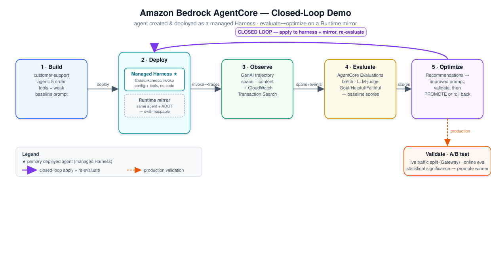

# Concepts: AgentCore Harness, Evaluations, Optimization

This demo exercises three Amazon Bedrock AgentCore capabilities that together form a
**closed quality loop**: observe → evaluate → improve. The agent is **created and deployed as a
managed AgentCore Harness**; the evaluate→optimize loop runs on a Runtime mirror of the same
agent (see the limitation note in §2). This doc explains each capability, maps it to the real
API, and points at the script that exercises it.



---

## 1. The agent harness — the primary create + deploy path

A managed **AgentCore Harness** is a config-driven agent: you declare the model, system prompt,
and tools, and AgentCore runs the orchestration loop — **no container, no orchestration code**.
Two API calls do it: `CreateHarness` (control plane) + `InvokeHarness` (data plane).

- **How the demo uses it:** `scripts/harness_create.py` calls `create_harness` / `update_harness`
  with the model, a (deliberately weak) baseline system prompt, and **5 inline-function tools**
  (`lookup_order`, `initiate_return`, `check_shipping_status`, `apply_discount`, `escalate_to_human`).
  `scripts/harness_agent.py` runs the **client-side tool loop**: `InvokeHarness` streams a
  `toolUse`, the client executes it (`agent/harness_tools.dispatch` → `agent/orders.py`) and
  returns a `toolResult`, looping until the model finishes. `scripts/invoke_deployed.py` (default
  `--target harness`) is the live demo.
- **Tool schema gotcha:** the tool `type` is the snake_case enum `inline_function`, but the config
  key is camelCase `inlineFunction`. `inputSchema` is a free-form JSON schema.
- **Memory:** disabled on this single-turn demo (`memory={"disabled": {}}`) — otherwise `InvokeHarness`
  needs `bedrock-agentcore:ListEvents` on the harness memory resource.
- **Observability:** set `OTEL_INSTRUMENTATION_GENAI_CAPTURE_MESSAGE_CONTENT=true` via the harness
  `environmentVariables` so its telemetry includes message content (off by default).

There is also an alternative **AgentCore Runtime** path (bring-your-own Strands code, deployed with
the `agentcore` CLI) in `agent/main.py` — see §2 for why the demo runs evaluation there.

| | Managed Harness (primary) | AgentCore Runtime (eval mirror) |
|---|---|---|
| You provide | **configuration** (model/prompt/tools) | agent **code** (Strands) |
| Orchestration loop | provided (managed) | yours |
| API / deploy | `CreateHarness` / `InvokeHarness` | `agentcore deploy` / `InvokeAgentRuntime` |
| Tool execution | client-side tool loop (`toolUse`/`toolResult`) | server-side in the container |

---

## 2. AgentCore Evaluations

A managed service that scores agent behavior with **LLM-as-a-judge** (built-in + custom evaluators).
It reads the agent's **GenAI trajectory** — spans from `aws/spans` plus **events** (with
`body.input/output.messages` content) from the agent's runtime log group — via CloudWatch
Transaction Search, and converts them to a unified format for scoring.

- **Built-in evaluators used:** `Builtin.GoalSuccessRate` (did the agent accomplish the task),
  `Builtin.Helpfulness`, `Builtin.Faithfulness`.
- **Mode:** batch — a set of sessions as one job (`StartBatchEvaluation` → poll `GetBatchEvaluation`).
- **How the demo uses it:** `scripts/generate_sessions.py` invokes the agent over a 10-prompt dataset;
  `scripts/run_evaluation.py` scopes the job by `serviceNames`, the runtime log group, and
  `filterConfig.sessionIds`, polls to terminal, and writes `results/<tag>_scores.json`.

> ### ⚠️ Why evaluation runs on the Runtime mirror, not the Harness
> The managed harness emits full GenAI telemetry — Strands spans
> (`invoke_agent`→`execute_event_loop_cycle`→`chat <model>`) in `aws/spans` plus per-message content
> events — and harness sessions that make **no tool call evaluate fine**. The blocker is specific to
> **tool use**: harness inline-function tools run via a **client-side tool loop**, where each tool call
> requires a second `InvokeHarness` request (to return the `toolResult`). AgentCore records each
> `InvokeHarness` request as a **separate trace** — its own root `POST /invocations` span — under the
> same `session.id`. A tool-using session therefore spans **≥2 disjoint traces**, and AgentCore
> Evaluations' span-mapper (which expects one connected agent trace per session) cannot assemble the
> trajectory, failing with **`AgentSpanMappingException: Failed to parse user_query from agent-span`**
> (scope `strands.telemetry.tracer`). Because this support agent is tool-driven, effectively every real
> harness session fails. The eval-mappable path is the same agent on **AgentCore Runtime**, which runs
> the tool loop **server-side in a single invocation** → one trace, one root (plus an
> `AgentCore.Runtime.Invoke` span the harness doesn't emit). So the demo:
> - **deploys + serves the agent as the managed Harness** (the requested create/deploy path), and
> - runs **evaluation + optimization against the Runtime mirror of the same agent** (same 5 tools,
>   same prompts), applying any improvement to **both**.
>
> **Verified live on 2026-06-27** (discriminating experiment on the same harness): 3 sessions with
> **no tool calls scored 3/3 evaluators**; 2 **tool-using** sessions failed all 3 with
> `AgentSpanMappingException`. Structurally, the no-tool session = **1 trace / 1 root span**; each
> tool-using session = **2 traces / 2 root spans**.
>
> > **Note — the `content.content` "double-nesting" is a red herring.** Strands telemetry serializes
> > message content as a stringified `content.content` blob in **both** harness and runtime, yet a
> > runtime session with that identical shape scores fine — so the mapper tolerates it. The real
> > differentiator is the multi-trace fragmentation above, not the content encoding.
>
> **Strong (untested) corollary:** only *client-side* `inline_function` tools fragment the trace.
> Server-side harness tools (MCP/Gateway/code-interpreter/browser) execute within one invocation and
> would likely keep a single trace → may be evaluable. Re-check: invoke the harness with a no-tool
> prompt vs a tool prompt, then `run_evaluation.py`.

---

## 3. AgentCore Optimization

Turns evaluation findings into validated improvements — the **improve** step.

### Recommendations (executed)
`scripts/run_optimization.py` calls `StartRecommendation` (`type=SYSTEM_PROMPT_RECOMMENDATION`) against
the baseline batch evaluation, targeting `Builtin.GoalSuccessRate`. It analyzes the traces, returns
an optimized system prompt + rationale (`results/recommendation.json`), writes it to `agent/prompts.py`
as `OPTIMIZED_PROMPT`, **and applies it to the harness via `UpdateHarness`**.

### Validate before promote — the loop's whole point
The improved prompt is re-deployed to the Runtime mirror, a fresh session set is generated, and
`run_evaluation.py` runs again → `results/improved_scores.json`. `scripts/compare.py` writes
`results/comparison.json` with per-evaluator deltas and a **promote / do-not-promote** decision.

**What happened in this run (an instructive, honest outcome):** the baseline scored `GoalSuccessRate
= 1.0` (no failures), so the recommendation had no failure traces to learn from and added a generic
"wait for explicit approval before acting" safety invariant. That made the agent *ask* instead of
*completing* tasks, regressing `GoalSuccessRate` **1.0 → 0.6**. The evaluation **caught the
regression**, the comparison returned **`promote: false`**, and the change was **rolled back to the
baseline prompt**. This is the protective value of evaluate-before-promote: the loop prevented a
quality regression from shipping. (A weaker baseline with real failures typically yields a promotable
gain instead.)

### A/B Testing (documented runbook)
`CreateABTest` splits **live** traffic between control (baseline) and treatment (optimized) variants
via an AgentCore Gateway, scores each session with an online evaluator, and reports statistical
significance. It needs a Gateway + config bundles + an online evaluation config + live traffic, so
`scripts/ab_test.py` provides the exact setup as a runbook rather than standing up that infrastructure.

---

## The loop, end to end

```
Create + deploy agent  ── managed AgentCore Harness (model + weak prompt + 5 inline tools)
  │                        invoke via InvokeHarness client-side tool loop
  │  (same agent mirrored on AgentCore Runtime for eval-mappable traces)
  ▼
Observe   GenAI spans + content events → CloudWatch Transaction Search
  ▼
Evaluate  AgentCore Evaluations (batch, LLM-judge) → baseline scores
  ▼
Optimize  Recommendations → improved prompt → apply to harness (UpdateHarness) + redeploy mirror
  ▼
Validate  re-evaluate → compare → PROMOTE or (this run) DO NOT PROMOTE → roll back
```
