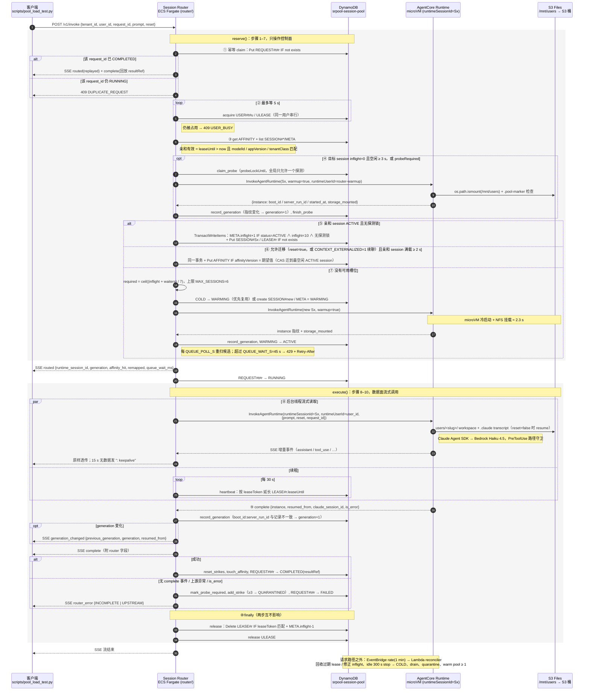

# Session Pool Demo：`userId → runtimeSessionId` 映射池实现

本文档描述 [`SESSION_POOL_ARCHITECTURE.zh.md`](SESSION_POOL_ARCHITECTURE.zh.md) 的可运行实现。
它在同一目录里新增了一套完整的部署、路由、回收和测试代码，与原有的单 session 压测脚本
（`scripts/load_test*.py`）并存、互不影响。

> 状态：已于 2026-09-08 在 `us-west-2`（账号 `434444145045`）实际部署并跑通短程与长程
> 场景（30 用户 × 2 轮，含故障注入）。用户 workspace 使用 **Amazon S3 Files**（跨 session 共享的
> BYO 文件系统）；不能使用 AgentCore managed session storage 的原因见 §5.3。实测数据见文末。
> 测试结束后请运行 `bash infra/destroy.sh` 释放资源。

## 1. 组件一览

```text
本机 EC2（客户端）
  scripts/pool_load_test.py ──HTTP/SSE──▶ internal ALB（安全组只放行本机 /32）
                                              │
                                              ▼
                                   ECS Fargate: router/（无状态 Session Router）
                                     ├── DynamoDB 单表  srpool-session-pool
                                     │     USER#t#u / AFFINITY   用户亲和
                                     │     USER#t#u / ULEASE     用户级串行 lease
                                     │     SESSION#s / META      SessionPool
                                     │     SESSION#s / LEASE#r   RequestLease
                                     │     REQUEST#t#r / IDEMPOTENCY
                                     └── InvokeAgentRuntime(runtimeSessionId=S1..SN)
                                              │
                                              ▼
                        AgentCore Runtime（1 个 ARN，microVM，VPC 模式，私有子网 + NAT）
                          ├── S1：inflight ≤ 10
                          ├── S2                    每个 microVM 都挂载同一个 S3 Files 访问点到 /mnt/users
                          └── SN                    ──NFSv4.2/TLS──▶ S3 Files ──同步──▶ S3 桶 users/<userSlug>/…
                                                                     （用户 workspace + Claude transcript，
                                                                      与 session 无关，可跨 session 迁移）

EventBridge rate(1 minute) ──▶ Lambda reconciler/（lease 回收、idle stop→COLD、drain、quarantine、warm pool）
```

| 目录 | 作用 |
|---|---|
| `app/server.py` | Runtime 容器（Claude Agent SDK + Bedrock Haiku 4.5 global）。新增 `request_id` 回显、`warmup` 探活（含 `storage_mounted` 挂载检查）、`boot_id/server_run_id/started_at` 指纹；`MAX_PARALLEL_AGENTS` 默认 10；`USERS_ROOT=/mnt/users` 落在 S3 Files 挂载点内 |
| `router/config.py` | 全部调度参数（环境变量驱动），默认值即架构文档推荐值 |
| `router/store.py` | DynamoDB 单表访问层：`TransactWriteItems` acquire/release、CAS 亲和迁移、幂等、探测锁、事务冲突重试 |
| `router/scheduler.py` | 纯策略函数（候选排序、扩容计算、亲和校验）+ `SessionRouter` 编排（reserve → execute） |
| `router/invoker.py` | AgentCore 数据面：warmup、增量 SSE 透传、`StopRuntimeSession`、409 退避 |
| `router/server.py` | FastAPI：`POST /v1/invoke`、`GET /v1/pool`、`POST /v1/admin/...` |
| `reconciler/handler.py` | EventBridge 定时 Lambda（与 `router/store.py` 共用代码打包） |
| `infra/deploy.sh` / `destroy.sh` | 纯 aws cli 的幂等部署与销毁 |
| `scripts/pool_load_test.py` | 客户端负载与不变量校验（短程 / 长程 / 故障注入） |
| `scripts/pool_admin.py` | 查看或重置池（stop 所有 session + 清空表） |
| `scripts/fanout_probe.py` / `flush_probe.py` | 数据面定向实验：同一 `runtimeSessionId` 上并发首调会拉起多少个 microVM、各环境的写入最终能否留存（§5.3 第 2 点的依据）；写入→stop 的 flush 时延 |
| `tests/test_pool_router.py` | 22 个单元测试（策略、SSE、事务冲突分类、探测、外部化迁移、完整 reserve/execute 流程） |
| `tests/test_pool_store_integration.py` | 对真实 DynamoDB 表的集成测试（设置 `POOL_TABLE` 后运行） |

## 2. 路由流程（对应架构文档 §8）

`POST /v1/invoke {tenant_id, user_id, request_id, prompt, reset}`：

1. **幂等 claim**：`REQUEST#…` 条件写入；已 `COMPLETED` 的请求直接回放结果，`RUNNING` 返回 409。
2. **用户级 lease**：同一用户串行；等待 5 s 后仍被占用返回 409 `USER_BUSY`。
3. **亲和校验**：`leaseUntil > now` 且 `modelId/appVersion/tenantClass` 匹配。
4. **探测（新增）**：目标 session 若 `inflight=0` 且空闲 ≥ `REPROBE_IDLE_S`（3 s），或上一个请求在它上面
   失败过，先用 DynamoDB 探测锁保证**只有一个** warmup 调用落到该 `runtimeSessionId`，记录 generation
   后再放行并发请求（原因见 §5.3 实测发现）。
5. **原子 acquire**：`TransactWriteItems`：`META.inflight+1 IF status=ACTIVE AND inflight<maxInflight
   AND 无探测锁` + `Put LEASE#requestId IF 不存在`；首次映射/迁移时在同一事务里
   `Put AFFINITY IF affinityVersion = 期望值`。
6. **迁移策略**：`reset=true`（新对话）允许在亲和 session 满载 2 s 后迁移到最空闲的 ACTIVE
   session。`reset=false`（续聊）的行为由 `CONTEXT_EXTERNALIZED` 决定：S3 Files 方案下默认为 1，
   workspace 和 Claude transcript 在共享文件系统上，续聊同样可以迁移（架构文档 §9 "上下文已外部化，
   CAS 迁移到其他 session"）；置 0 则严格留在亲和 session，满载排队，超过 `QUEUE_WAIT_S`（45 s）
   返回 **429 + Retry-After**。同一用户始终由用户级 lease 串行，不会有两个 session 同时写同一目录。
7. **扩容**：`required = ceil((inflight + waiters) / 7)`，上限 `MAX_SESSIONS=6`；优先复用
   COLD session，否则生成新 `runtimeSessionId` → WARMING → warmup → ACTIVE。正在 warm 的
   session 计入 pending，避免并发等待者超配。
8. **执行**：后台线程流式读取 `InvokeAgentRuntime`，SSE 原样透传给客户端并附加
   `routed / generation_changed` 事件；每 30 s heartbeat 续租；15 s 无数据发 `: keepalive`。
9. **完成校验**：没有最终 `complete` 事件视为失败（strike，≥3 次 QUARANTINED）；`complete`
   中的 `boot_id` 与记录不一致则 generation+1。
10. **`finally` 释放**：按 `leaseToken` 删除 lease 并 `inflight-1`，释放用户 lease，二者互不影响。

### 2.1 端到端时序图

下图把上述 10 步按参与方展开（编号与上文一致）。`reserve` 阶段（1–7）只与 DynamoDB 交互，
除探测 / warmup 外不碰数据面；`execute` 阶段（8–10）才真正调用 `InvokeAgentRuntime`。
代码对应 `router/server.py::invoke` → `router/scheduler.py::SessionRouter.reserve / execute` →
`router/invoker.py`。



不渲染 Mermaid 的环境可直接看导出图：[`assets/pool-invoke-sequence.zh.png`](assets/pool-invoke-sequence.zh.png)。

## 3. 部署

前置：`aws`（v2，含 `s3files` 子命令）、`docker`（可构建 linux/arm64）、`jq`、`zip`、`uv`；调用者具备创建
IAM/DynamoDB/S3/S3 Files/EC2 网络/ECR/ECS/ELB/Lambda/EventBridge/AgentCore 资源的权限。

```bash
cd 16-shared-runtime-microvm
# 推荐：复用已有的、经 NAT 出网的私有子网（Runtime 与 S3 Files mount target 落在这个 VPC）
RUNTIME_SUBNET_IDS=subnet-aaa,subnet-bbb bash infra/deploy.sh
# 或者不指定：脚本在默认 VPC 里创建 2 个私有子网 + 1 个 NAT Gateway（需要 1 个空闲 Elastic IP）
bash infra/deploy.sh
```

脚本会创建：4 个 IAM 角色 + S3 Files 服务角色、DynamoDB 表、两个镜像、S3 桶（开启版本控制，S3 Files
要求）、S3 Files 文件系统 / 每个 AZ 一个 mount target / 访问点（root `/users`，POSIX 0:0）、Runtime
（VPC 模式，`s3FilesAccessPoint` 挂到 `/mnt/users`）、internal ALB + ECS Fargate Router、Lambda +
EventBridge，最后写出 `pool.json`。

关键可覆盖项（见 `infra/env.sh`）：

```bash
REGION=us-west-2 PREFIX=srpool \
MODEL_ID=global.anthropic.claude-haiku-4-5-20251001-v1:0 \
CLIENT_CIDR=172.31.30.139/32 \          # 默认自动取本机 EC2 私网 IP；ALB 只放行它
WORKSPACE_BUCKET=... S3FILES_ROOT=/users MOUNT_PATH=/mnt/users \
MAX_SESSIONS=6 TARGET_INFLIGHT=7 MAX_INFLIGHT=10 MIN_WARM_SESSIONS=1 CONTEXT_EXTERNALIZED=1 \
SKIP_IMAGE_BUILD=1 SKIP_RUNTIME_UPDATE=1 \   # 只改 Router 时使用
bash infra/deploy.sh
```

注意：

- ALB 为 **internal**，安全组入口只有 `CLIENT_CIDR`，从不放行 `0.0.0.0/0`；task 安全组只接受 ALB。
- 调用 `InvokeAgentRuntime` 时携带 `runtimeUserId`，IAM 必须同时授予
  `bedrock-agentcore:InvokeAgentRuntime` **和** `bedrock-agentcore:InvokeAgentRuntimeForUser`。
- S3 Files 强制 Runtime 使用 VPC 模式；文档明确 Runtime 放在公有子网**没有**出网能力，必须私有子网 +
  NAT（或为 bedrock-runtime / ecr / logs / s3 建 VPC endpoint）。
- 容器以 root 运行，S3 Files 对 uid 0 做 root squash：执行角色除 `s3files:ClientMount/ClientWrite`
  外还需要 **`s3files:ClientRootAccess`**（均带 `AccessPointArn` 条件），否则挂载成功但 `Permission denied`；
  `s3files:GetAccessPoint` 需要直接授予在访问点 ARN 上，Runtime 创建/更新时会校验。
- `update-agent-runtime` 会产生新版本并替换所有执行环境；脚本检测到版本变更时会自动清空池表。
  用户数据在 S3 Files 上，不受影响。只改 Router 代码请加 `SKIP_RUNTIME_UPDATE=1`。
- 销毁：`bash infra/destroy.sh`（`DELETE_ECR_IMAGES=1` 删镜像；`DELETE_BUCKET=1` 删用户数据桶）。
  复用外部子网时同样设置 `RUNTIME_SUBNET_IDS`，脚本据此找到 Runtime VPC 里的安全组。

## 4. 测试

```bash
# 单元测试（无 AWS）+ 真实 DynamoDB 集成测试
POOL_TABLE=srpool-session-pool AWS_REGION=us-west-2 uv run python -m unittest discover -s tests

# 短程：30 用户 × 2 轮（echo → recall），轮间对最忙的 session 注入故障
uv run python scripts/pool_load_test.py --scenario short --users 30 --rounds 2 --chaos --chaos-mode stop   # StopRuntimeSession，验证 generation 检测
uv run python scripts/pool_load_test.py --scenario short --users 30 --rounds 2 --chaos --chaos-mode drain  # 置 DRAINING，验证用户迁移后仍能 resume

# 长程：30 用户 × 两阶段 webapp 项目，轮间故障注入，结束后用 S3 API + microVM 内 find 核对每个用户的 6 个文件
uv run python scripts/pool_load_test.py --scenario long --users 30 --chaos --chaos-mode drain --verify-files

# 运维
uv run python scripts/pool_admin.py show
uv run python scripts/pool_admin.py reset --yes
curl -s http://<alb>/v1/pool | jq
```

客户端在运行期间每 2 s 轮询 `/v1/pool`，最终输出并断言以下不变量：

| 不变量 | 含义 |
|---|---|
| `inflight_never_exceeded_cap` / `leases_never_exceeded_cap` | 任意快照中每 session inflight 与有效 lease ≤ 10 |
| `sessions_within_max` / `active_sessions_within_max` | 使用与同时 ACTIVE 的 session 数 ≤ `MAX_SESSIONS` |
| `follow_ups_resumed` | 续聊 `resumed_from != null`（S3 Files 下允许落在别的 session） |
| `chaos_generation_detected` / `chaos_users_still_resumed` | `--chaos-mode stop`：故障注入后检测到 generation 变化，且受影响用户仍能恢复对话 |
| `chaos_users_migrated` / `chaos_users_still_resumed` | `--chaos-mode drain`：受影响用户的续聊全部落到其他 session，且仍然 resume |
| `all_projects_complete_in_s3` / `all_projects_complete_in_workspace_fs`（长程） | 每个用户 `users/<slug>/webapp/` 下恰好 6 个对象（S3 API 直接核对 + microVM 内 `find`） |

## 5. 实测结果与发现（2026-09-08，us-west-2）

原始数据：`results/pool_short_*.json`、`results/pool_long_*.json`、`results/pool_*_s3files_*.log`。
部署形态：Runtime VPC 模式，复用账号里 `agentcore-vpc` 的两个私有子网（各自经 NAT 出网；默认 VPC 的
Elastic IP 配额已满，脚本支持 `RUNTIME_SUBNET_IDS` 复用）；S3 Files 文件系统 `fs-0a452ec5c8d9b4901`
挂 S3 桶 `srpool-workspaces-434444145045-us-west-2`，访问点 root `/users`，每个 microVM 挂到 `/mnt/users`。

### 5.1 路由与容量

三个场景各 30 用户 × 2 轮，**180/180 请求成功，全部不变量通过**：

| 场景 | 结果 |
|---|---|
| 短程 30 × 2，`--chaos-mode drain` | 60/60；池从 1 个 ACTIVE 扩到 5 个，inflight 峰值 10/7/6/7/7/3；echo p50/p90 8.4/8.9 s，排队 p90 2.6 s |
| 长程 30 × 2，`--chaos-mode stop` | 60/60；5 个 session，inflight 峰值 9/3/1/10/7；foundation p50/p90 50.6/60.5 s，final-qa 55.4/72.6 s |
| 长程 30 × 2，`--chaos-mode drain` | 60/60；inflight 峰值 5/7/10/10/8；foundation p50 53.9 s，final-qa p50 46.7 s（最大 370 s 是一次 34 个工具调用的正常长跑） |

- 每 session inflight **从未超过 10**；无 429。目标 7 是扩容水位不是准入上限，突发时第一个 session 会被
  填到 10，新 session ACTIVE 后等待者再按最空闲优先分散（见 §2 第 7 步）。
- 新 session 的 warmup（microVM 冷启动 + NFS 挂载）约 **2.3 s**；短程请求端到端 p50 约 6–8 s，长程
  每阶段 p50 约 47–55 s（Haiku 4.5）。NFS 未带来可观察的退化。
- 第二轮续聊 `resumed_from` 全部非空。`--verify-files` 用 S3 API 直接列对象：30/30 用户的
  `users/<slug>/webapp/` 下恰好 6 个对象；microVM 内 `find` 同样 30/30。

### 5.2 故障注入

`--chaos` 在两轮之间对分配用户最多的 session 注入故障，受影响用户约 10 个。

**`stop`：`StopRuntimeSession`，且不改 DynamoDB 状态**（模拟 microVM 被服务端换掉而控制层不知道）。
下一次有请求指向该 session 时，Router 的空闲探测从 `instance.boot_id:server_run_id` 发现环境已换代，
generation 1→2（日志 `probe found a new execution environment`）。因为 workspace 和 Claude transcript
在 S3 Files 上，新环境挂上同一份文件系统，10 个用户全部 `resumed_from != null` 并在原项目上继续 phase 2。

**`drain`：把 session 置为 DRAINING**（模拟接近 maxLifetime 或运维下线）。10 个用户的续聊被 CAS 迁移到
其他 session（`remap 10`，`chaos_users_migrated` PASS），短程用户正确回忆上一轮 token，长程用户在
**项目中途换 session 继续 phase 2**，S3 与 microVM 内核对均 30/30 完整。这是用户数据与调度单元解耦后才
可能的行为，也是架构文档 §9 "上下文已外部化，CAS 迁移到其他 session" 的直接验证。

### 5.3 为什么不能用 managed session storage

AgentCore 的 managed session storage 是**按 `runtimeSessionId` 隔离**的持久卷。在这个架构里
`runtimeSessionId` 是调度单元（可被 drain、quarantine、回收、按负载迁移用户），不是用户数据的归属单元，
两者绑在一起有两个后果：

1. 用户一旦离开原 session（亲和 session 满载、DRAINING、QUARANTINED、记录被清理），workspace 和
   transcript 就留在了旧 session 的卷里——续聊只能严格留在原 session，架构文档 §9/§10 要求的迁移和
   外部化都做不到。
2. 同一 `runtimeSessionId` 的当前环境被终止后，N 个并发首次调用会拉起接近 N 个 microVM，每个都有
   自己的一份卷，服务端最终只保留其中一个、其余整卷丢弃（`scripts/fanout_probe.py` 实测：12 个并发写
   丢 10 个，已持久化的旧文件也可能被空卷覆盖）。数据的存活取决于哪个环境"胜出"。

因此 workspace 必须放在与 session 无关的共享文件系统上。当前实现使用 Amazon S3 Files（BYO，
NFSv4.2/TLS，跨 session、跨环境共享，底层就是 S3 对象）；EFS 是同类替代。代价是 Runtime 必须走 VPC
模式（私有子网 + NAT 或 VPC endpoint），以及执行角色需要 `s3files:ClientRootAccess`（容器以 root 运行）。

### 5.4 换代瞬间的并发 fan-out 与探测

上面第 2 点的 fan-out 在 S3 Files 下不再丢整卷（所有环境写同一个文件系统），但仍然意味着同一 session
同时有多个 microVM、重复计费、同一用户目录可能被两个环境交错写。Router 因此在放行前做**单点探测**：
DynamoDB 探测锁（`probeLockUntil`）保证只有一个 warmup 调用落到该 session，拿到唯一的新环境并记录
generation 后才放行并发请求；acquire 事务的条件包含"无探测锁"。触发条件：session `inflight=0` 且空闲
≥ `REPROBE_IDLE_S`（默认 3 s，活环境上一次探测约 100 ms），或上一个请求在该 session 上失败
（`probeRequired`，覆盖"环境在请求飞行中被杀"）。COLD → WARMING 本来就是单点 warmup。

两个相关的实测事实：

- `/proc/sys/kernel/random/boot_id` **不是环境唯一的**（microVM 从快照恢复，几十个环境只见到两个值），
  generation 标记因此使用 `boot_id:server_run_id`（进程级 uuid）。
- warmup 响应带 `storage_mounted`（`os.path.ismount`）和 `.pool-marker` 检查：挂载缺失直接拒绝
  warmup，避免写到 microVM 的临时根盘；generation>1 而标记缺失则记 `storage_reset_detected` 并打 ERROR。

### 5.5 其他实测注意点

- S3 Files 到桶的导出是异步的（约 60 s 内）：测试刚结束用 S3 API 列对象会少几个，`--verify-files` 因此
  轮询最多 150 s；microVM 内的文件系统视图始终完整。
- 共享文件系统意味着每个 session 都能看到所有用户的目录：隔离仍然只靠应用层（路径守卫、用户 lease、
  `runtimeUserId` 一致性），与架构文档 §5/§16 "同一信任域内共享" 的前提一致；不同 tenant 应使用不同的
  访问点 root 或不同的文件系统。放开迁移后，用户级 lease 是唯一防止同一用户在两个 session 上同时写
  同一目录的机制。
- 突发 30 个 `TransactWriteItems` 打在同一个 `META` item 上会返回
  `TransactionCanceledException[TransactionConflict]`，它**不是**条件失败，必须带抖动重试
  （`store.with_conflict_retry`）。
- Haiku 4.5 偶尔会先尝试 `/tmp/webapp`、`/root/webapp` 这类绝对路径，被 PreToolUse 路径守卫拒绝后自行
  改回相对路径；加强 system prompt 后基本不再出现。守卫拒绝计入 `guard-denials`，不算失败。
- 单个请求可能遇到 Bedrock 瞬时 `API Error`；生产上应按幂等规则重试。
- `update-agent-runtime` 后的新版本会替换所有执行环境：部署脚本已自动清空池表，用户数据不受影响。
- 成本：相比按 session 的存储多了 NAT Gateway（复用已有的则为 0）、S3 Files 按用量计费、桶存储；换来的是
  用户数据与调度单元解耦，以及可以直接用 S3 API 做备份、审计和离线处理。
- `.claude/projects/<workspace>/…` transcript 直接成为 S3 对象，这就是续聊可以跨 session 的原因。

## 6. 与架构文档的对应关系及未实现项

| 文档章节 | 实现 |
|---|---|
| §7 数据模型 | 单表 + GSI1（`POOL#region#tenantClass#modelId#appVersion#shard` / `status#sid`），2 个 shard |
| §8 原子分配 / 释放 | `store.try_acquire` / `store.release`（token 校验、幂等） |
| §9 用户串行、满载排队、429 | `ULEASE`、`QUEUE_WAIT_S`、`Retry-After` |
| §10 状态与 generation | 用户 workspace + Claude transcript 外部化到 S3 Files（跨 session 共享）；`boot_id:server_run_id` 比对 + 探测锁 |
| §11 生命周期 | reconciler：idle 300 s stop → COLD，drain at 7h15m，warm pool ≥1 |
| §13 弹性 | `required = ceil((inflight+waiters)/7)`，COLD 优先复用 |
| §15 故障恢复 | 过期 lease 回收、inflight 修正、strike / QUARANTINED、409 退避、`probeRequired` |
| §17 观测 | `/v1/pool` 快照 + Lambda 发布 `SharedRuntimeSessionPool` CloudWatch 指标 |

未实现（第二轮候选）：对话摘要写入 AgentCore Memory（当前靠 Claude 原生 transcript resume）；
SQS FIFO 异步队列；HTTPS/ACM；Router 多副本下的 waiters 聚合（当前 waiters 为进程内计数，
多副本时应改用 SQS 深度或 DynamoDB 计数）；按 tenant 拆分 S3 Files 访问点。
