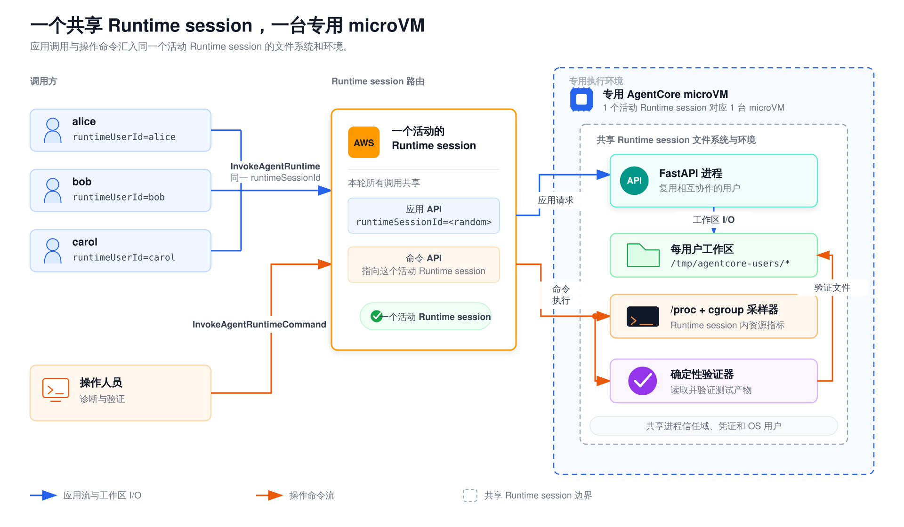

# 共享 AgentCore microVM Runtime：多用户并发测试

[English version / 英文版](README.md)

这个独立演示把多个相互协作的应用用户放进**同一个 AgentCore Runtime session**，
测量 Claude Agent 的短程与长程工作负载。演示通过
`InvokeAgentRuntimeCommand` 对活动容器采样并验证长程任务文件，不依赖 SSM、EC2、
ASG，也不依赖托管宿主的实现细节。

> 状态：真实 AWS 测试矩阵覆盖了 2/4/8/12/16/24/32/40 的短程真实并发
> （**138/138 成功**），以及 1/2/4/8/12/16/24/32/40 的两阶段长程负载。
> 长程 1–32 档完成了 **99/99 次确定性端到端验证**；40 档的端到端成功数为
> 0/40，因为每条流都缺少最终的完成事件，监控也不可用。报告建议最多运行
> 24 个活动长程 Agent，以保留运行余量；32 是经过测试的边缘值，不适合作为常规目标。
> 所有专用测试 Runtime 和 Runtime session 均已停止，ECR 镜像予以保留。统一表格、
> 原始文件名、资源数据、限制与清理证据见中文
> [`results/REPORT.md`](results/REPORT.md)。

## 这个演示能证明什么，不能证明什么

每轮测试都会生成一个新的随机 `runtimeSessionId`。所有虚拟用户调用同一个 Runtime
session ID，同时分别携带不同的 `runtimeUserId` 和 `payload.user_id`。因此，
AgentCore 会把整轮测试路由到专用于该 Runtime session 的 microVM，应用再通过以下机制
在容器内复用多个用户：

- 校验 `runtimeUserId` 请求头与请求体中的身份是否一致，并在
  `/tmp/agentcore-users` 下为每个用户创建哈希目录；
- 使用检查路径的 `PreToolUse` 钩子（包括 Glob 模式），拒绝工作区符号链接，
  并禁用 Bash/Web/Task 工具；应用使用双向 `ClaudeSDKClient`，因为固定版本 SDK
  中的一次性 `query()` 不会执行 Python 函数钩子；
- 在每个工作区中分别保存 Claude 对话 ID；
- 每个用户各有一把锁，同一用户的调用串行执行，不同用户可以并行；
- 使用一个全局 Claude 进程信号量。

**microVM 是不同 Runtime session 之间的隔离边界**。同一 Runtime session 内的用户
共享容器、进程信任域、凭证和 OS 用户。路径守卫只适用于相互协作或威胁较弱的场景，无法
把互不信任的用户隔离成独立租户。不要向最终用户授予直接调用 AgentCore 的权限，也不要
让命令执行接口接收用户提供的文本。

默认 Runtime session 使用临时存储。Runtime session 停止、空闲超时或达到计算生命周期
上限后，`/tmp/agentcore-users` 和测试产物都会消失。Runtime 计算资源的**最长生命周期
为 8 小时**；本演示没有配置外部持久化，也没有配置 Capacity Provider 文件系统。

## 目录结构

```text
16-shared-runtime-microvm/
├── app/
│   ├── isolation.py
│   └── server.py
├── docker/Dockerfile
├── scripts/
│   ├── runtime_session.py
│   ├── deploy.sh
│   ├── cleanup.sh
│   ├── invoke_multiuser.py
│   ├── load_test.py
│   └── load_test_longrun.py
├── tests/
├── results/REPORT.md
├── pyproject.toml
├── uv.lock
└── README.md
```

直接依赖均精确锁定版本，完整的 Python 依赖解析结果冻结在 `uv.lock` 中。其中，
`boto3==1.42.59` 包含 `invoke_agent_runtime_command`、
`invoke_agent_runtime` 和 `stop_runtime_session`。镜像使用精确的 Node.js
`22.19.0`、Claude Code `2.1.232` 和 uv `0.8.13` 镜像标签，再通过
`uv sync --frozen` 安装依赖。

## 架构

[](assets/architecture.zh.svg)

命令 API 与应用运行在同一个活动 Runtime session 文件系统和环境中。它**不会**自动解析
shell 语法：代码仓库内维护的脚本先经过 base64 传输，再由明确的 `/bin/bash -c`
包装层执行。该接口不接受提示词，也不接受用户控制的 shell 内容。

## 前置条件

- Docker 支持构建 `linux/arm64` 镜像。
- AWS CLI v2 已配置部署账号和区域。
- 客户端使用 Python 3.13，建议安装 uv。
- AgentCore Runtime 执行角色（`ROLE_ARN`）能够拉取镜像并调用配置的 Bedrock
  模型。
- Runtime 在 2026-03-17 之后创建或重新部署。新 Runtime 自动支持命令执行，旧 Runtime
  需要重新部署。

安装精确锁定的本地依赖：

```bash
cd 16-shared-runtime-microvm
uv sync --frozen
```

本地单元测试不使用 AWS 凭证，也不会发起网络请求。

## IAM

### 测试执行主体

如果 IAM 配置允许，请把 `Resource` 限定为生成的 Runtime ARN：

```json
{
  "Version": "2012-10-17",
  "Statement": [
    {
      "Effect": "Allow",
      "Action": [
        "bedrock-agentcore:InvokeAgentRuntime",
        "bedrock-agentcore:InvokeAgentRuntimeForUser",
        "bedrock-agentcore:InvokeAgentRuntimeCommand",
        "bedrock-agentcore:StopRuntimeSession"
      ],
      "Resource": "arn:aws:bedrock-agentcore:REGION:ACCOUNT:runtime/RUNTIME_ID"
    }
  ]
}
```

`InvokeAgentRuntimeCommand` 可以查看 Runtime session 文件系统和其中可用的凭证。只应
把该权限授予受限的诊断或测试角色，不要授予不可信调用者。

### 部署主体

`scripts/deploy.sh` 还需要创建、更新、获取和列出 Runtime 的控制面权限、ECR
仓库和镜像推送权限、针对 `ROLE_ARN` 的 `iam:PassRole` 权限，以及
`sts:GetCallerIdentity`。`scripts/cleanup.sh` 需要
`bedrock-agentcore:DeleteAgentRuntime`；如果还要删除 ECR 镜像，则需要
`ecr:BatchDeleteImage`。

Runtime 执行角色本身需要常规的 AgentCore 镜像拉取和日志权限，还要能够调用所选
Bedrock 模型。请沿用组织现有的执行角色策略，不要把账号范围的角色直接复制到本演示中。

## 部署

这条部署路径已于 2026-08-14 在 AWS 上实际执行。复现时请设置执行角色，然后运行：

```bash
cd 16-shared-runtime-microvm
ROLE_ARN='arn:aws:iam::ACCOUNT:role/YOUR_AGENTCORE_RUNTIME_ROLE' \
REGION=us-west-2 \
bash scripts/deploy.sh
```

可用的覆盖项：

```bash
ROLE_ARN="$ROLE_ARN" \
RUNTIME_NAME=shared_runtime_microvm \
REPO=launchpad-agents \
TAG=shared-runtime-microvm-v1 \
MODEL_ID=us.anthropic.claude-sonnet-4-6 \
MAX_PARALLEL_AGENTS=8 \
MAX_TURNS=64 \
bash scripts/deploy.sh
```

脚本会构建并推送 ARM64 镜像，创建或更新普通 Runtime，等待其进入 `READY` 状态，再以
原子方式写入 `runtime.json`。脚本会有意省略 `capacityProviderConfiguration` 和
`filesystemConfigurations`，并拒绝转换同名的现有 Capacity Provider Runtime。

## 测试 1：多用户冒烟测试

```bash
uv run python scripts/invoke_multiuser.py
```

冒烟测试执行以下检查：

1. 预热一个新的共享 Runtime session；
2. 在同一个 Runtime session 中运行命令，并把 `/proc` 引导 ID 和主机名与应用指纹对比；
3. 为至少三个用户并发创建和读取各自的唯一 token；
4. 确认所有应用响应使用同一个完整进程指纹（引导 ID、进程运行 ID、PID 和主机名），
   同时使用不同的工作区；
5. 尝试通过相对路径和绝对路径跨工作区读取文件；
6. 恢复每个用户的 Claude 对话，检查它能回忆自己的 token，且不包含其他用户的 token；
7. 在 `finally` 中调用 `StopRuntimeSession`。

选项：

```bash
uv run python scripts/invoke_multiuser.py \
  --users alice,bob,carol \
  --request-timeout 900 \
  --results-dir results
```

## 测试 2：短程并发爬坡

从保守档位开始：

```bash
uv run python scripts/load_test.py \
  --levels 2,4,8 \
  --success-floor 0.80 \
  --request-timeout 900 \
  --monitor-duration 3600
```

每一档都通过屏障同时释放 N 个新用户。每个请求都必须准确返回自己的唯一标记、
一个新的 Claude 会话、该档内唯一的工作区，以及完整的预热进程指纹。结果会记录
成功/失败、p50/p90/max 延迟、错误、工作区、Claude 会话元数据和不同进程的数量。

预热完成后，测试通过 `InvokeAgentRuntimeCommand` 启动一个脱离终端的 Python
采样器。它每两秒读取一次：

- `/proc/stat` 中的 CPU 增量；
- `/proc/meminfo` 中的已用/可用内存；
- `/proc/loadavg` 中的 load1；
- `/proc/*/comm` 中 `node`/`claude` 进程的数量；
- cgroup v2 的 `memory.current` 和 `memory.max`，前提是这些文件可读。

采样器位于 `/tmp/agentcore-loadtest/<run-id>/`。清理时，程序会读取记录的 PID，
验证其命令行后再发送信号，不会使用范围过大的 `pkill`。

## 测试 3：两阶段长程并发爬坡

开始并发范围更大、费用可能更高的测试前，建议先运行单用户冒烟测试：

```bash
uv run python scripts/load_test_longrun.py \
  --levels 1 \
  --success-floor 0.75 \
  --request-timeout 1800 \
  --monitor-duration 7200
```

操作人员应先检查该结果，再明确选择更高档位：

```bash
uv run python scripts/load_test_longrun.py --levels 2,4,8
```

每个用户执行两个阶段：

1. **foundation**：创建四个离线项目文件；
2. **final QA**：恢复阶段 1，新增两个文件，并修复全部六个文件。

在命令验证**之前**，应用证据会先以原子方式写入检查点。随后，确定性 Python
验证器在同一个活动 microVM 内运行，并且要求文件集合严格等于：

```text
index.html  about.html  styles.css  app.js  README.md  loadtest.json
```

验证会拒绝符号链接、缺失或多余的条目、过小的文件、断开的 HTML/CSS/JS 引用、缺少
480px/768px 规则、缺少 `localStorage`/`textContent`、任何 `innerHTML`、错误的
运行令牌，以及清单键、值或文件集合不匹配。Agent 自报成功与产物验证成功使用
不同字段记录。

## 命令与失败语义

`scripts/runtime_session.py` 是两个负载测试唯一使用的命令和调用实现。命令必须同时满足
以下条件才算成功：

- 命令 API 的 HTTP 状态为 `200`；
- 响应确认了请求中的 `runtimeSessionId`；
- 恰好有一个 `contentStart`，之后是零个或多个 stdout/stderr `contentDelta`
  事件，最后有一个 `contentStop`；
- 没有流异常、未知事件、格式错误的数据块、重复事件或乱序内容事件；
- `contentStop.status == "COMPLETED"`；
- `contentStop.exitCode == 0`。

封装结构与 boto3 官方的 `chunk` 事件联合类型一致。只有在预置或拆除期间出现的 HTTP
409 `RetryableConflictException` 冲突会按有限次数指数退避重试，其他错误立即失败。

每个完成的负载档位都会以原子方式写入 JSON。监控失败或产物命令失败不能抹掉 Agent
响应，结果会明确给出 `monitor_available`、`monitor_error(s)`、
`verification_available` 和 `verification_error`。缺少验证时，结果绝不会标记为
验证成功。

## 清理与成本控制

三个客户端默认都会在 `finally` 中调用 `StopRuntimeSession`。两个负载客户端共用一套
收尾逻辑，即使监控收尾过程被中断，也会继续清理 Runtime session。停止成功要求 HTTP
200，并且返回的 Runtime session ID 必须与请求完全一致。这样可以避免等待空闲超时，
也不会继续为未使用的计算资源付费。

以下配置只用于特殊调试：

```bash
STOP_SESSION=0 uv run python scripts/load_test.py --levels 1
# equivalent: --keep-session
```

程序会打印并记录警告。Runtime session 在空闲超时或达到 8 小时生命周期上限前仍可能
持续计费。调试结束后应立即显式停止。

完成后删除已部署的 Runtime：

```bash
bash scripts/cleanup.sh
```

ECR 镜像和 IAM 角色默认保留。如果还要删除带该标签的镜像：

```bash
DELETE_ECR_IMAGE=1 bash scripts/cleanup.sh
```

## 本地验证

```bash
uv lock --check
uv sync --frozen
python3 -m compileall -q app scripts tests
python3 -m unittest discover -s tests -v
for file in scripts/*.sh; do bash -n "$file"; done
python3 scripts/invoke_multiuser.py --help
python3 scripts/load_test.py --help
python3 scripts/load_test_longrun.py --help
uvx --from ruff==0.12.11 ruff check app scripts tests
uvx --from ruff==0.12.11 ruff format --check app scripts tests
uvx --from pyright==1.1.411 pyright
```

这些检查覆盖代码、解析器、模拟事件流、隔离路径、监控 CSV 统计、原子写入和六文件
验证器。最终的 2026-08-15 质量门禁通过了 **45/45 项单元测试**、Ruff 检查和格式检查、
零错误零警告的 Pyright、shell 语法检查、三个 CLI 帮助路径、server 导入和
`git diff --check`。本地检查本身不能证明云端容量；真实 AWS 证据及其适用边界记录在
`results/REPORT.md` 中。

## 阅读结果

生成的 JSON 已被 Git 忽略，默认存放在 `results/` 下。不要只根据请求数量推导并发建议：
应用信号量可能让超额用户排队，任务时长也会改变进程驻留情况。报告中必须同时给出配置的
`MAX_PARALLEL_AGENTS` 和请求并发度，并区分：

- Agent 标记成功；
- Runtime session、工作区和指纹契约成功；
- 产物验证成功；
- 资源监控可用。

`15-shared-runtime-instance/` 中的 EC2 Capacity Provider 数据来自不同的计算拓扑，
只能作为参考，不能复制或改名后当作 microVM 结果。
