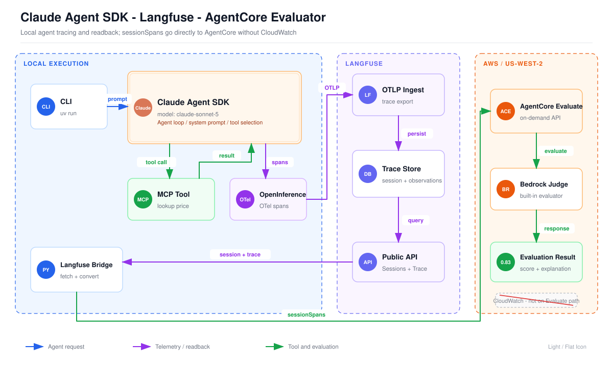
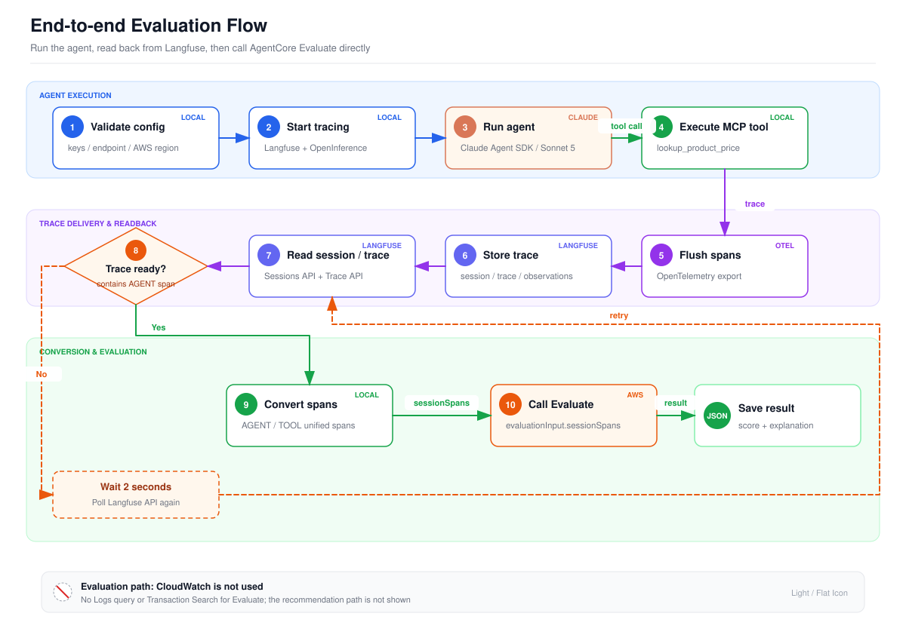

# Claude Agent SDK → Langfuse → AgentCore Evaluations

This example runs a tool-using agent with **Claude Agent SDK** and
`claude-sonnet-5`, exports its OpenTelemetry trace to **Langfuse**, reads the
session and full trace back from the Langfuse API, and submits the reconstructed
session spans directly to the Amazon Bedrock AgentCore `Evaluate` API.

**CloudWatch is not used anywhere in this pipeline.** The AWS guide retrieves
spans from CloudWatch because that is its default telemetry store; the
on-demand `Evaluate` API itself accepts caller-provided `sessionSpans`.

## 架构图



[查看 1920px PNG 原图](assets/architecture.light.png)

这张图从左到右分为三个区域，展示了 Agent 执行、可观测数据存储和按需评估之间的边界：

1. **本地执行区（Local Execution）**：CLI 启动 Claude Agent SDK，并固定使用 `claude-sonnet-5`。Agent 在推理过程中调用本地 MCP 工具 `lookup_product_price`，工具结果再返回 Agent，用于生成最终回答。
2. **Telemetry 采集与 Langfuse**：OpenInference 自动把 Agent 和工具调用转换为 OpenTelemetry spans，通过 OTLP 发送到 Langfuse。Langfuse 按 session、trace 和 observation 保存完整调用链，并通过 Sessions API 与 Trace API 对外提供查询。
3. **Langfuse Bridge**：本地桥接代码先从 Langfuse 读回指定 session 和完整 trace，再把 `AGENT`、`TOOL` observations 转换为 AgentCore 支持的 unified session spans。转换后的数据包含 `session.id`、`traceId`、`spanId`、`input.value` 和 `output.value` 等字段。
4. **AgentCore 评估区**：桥接代码把 `sessionSpans` 直接提交给 AgentCore `Evaluate` API。AgentCore 调用内置 Bedrock evaluator 完成评分，并返回分数、标签和解释；图中的 `0.83` 是本示例真实运行 `Builtin.Helpfulness` 得到的结果。

图中的蓝色箭头表示 Agent 请求，紫色箭头表示 telemetry 上报与 trace 回读，绿色箭头表示工具调用和评估数据流。右下角被划掉的 CloudWatch 表示本方案**不会查询 CloudWatch Logs，也不依赖 Transaction Search**；Langfuse 是唯一的 trace 数据来源。

## 流程图



[查看 1920px PNG 原图](assets/evaluation-flow.light.png)

流程图把一次完整评估拆成三个阶段：

1. **Agent 执行（步骤 1–4）**：程序先检查 Claude、Langfuse 和 AWS 配置，然后初始化 Langfuse 与 OpenInference instrumentation，运行 Claude Agent，并执行需要的 MCP 工具调用。
2. **Trace 写入与回读（步骤 5–8）**：Agent 完成后调用 `langfuse.flush()`，确保 spans 被发送到 Langfuse。随后程序通过 Sessions API 和 Trace API 读取数据，并检查 trace 中是否已经出现 `AGENT` span。由于 Langfuse 写入存在短暂的最终一致性，如果数据尚未就绪，程序会等待 2 秒后继续轮询，而不是转而查询 CloudWatch。
3. **转换与评估（步骤 9–10）**：程序筛选 `AGENT` 和 `TOOL` observations，按 AgentCore Claude Agent SDK 的 unified telemetry 约定生成 `sessionSpans`，然后调用 `bedrock-agentcore.evaluate()`。评估结果最终写入 `results/evaluation.json`，转换后的原始 spans 写入 `results/session_spans.json`。

整个流程中，Claude 调用、工具调用和 trace 上报发生在前半段；AgentCore 只接收从 Langfuse 读回并转换后的 spans。这样可以保留 AgentCore evaluator 的能力，同时让 Langfuse 承担统一的可观测数据存储与查询职责。

可编辑的 SVG、PNG 和可重复执行的生成脚本均位于 `assets/`。重新生成图片：

```bash
python3 assets/generate_diagrams.py
```

## Data flow

```text
Claude Agent SDK
  └─ OpenInference instrumentation
       └─ Langfuse OpenTelemetry exporter
            └─ Langfuse Sessions API + Trace API
                 └─ unified OpenInference session spans
                      └─ bedrock-agentcore.evaluate(...)
```

The conversion follows AgentCore's documented Claude Agent SDK contract:

- scope: `openinference.instrumentation.claude_agent_sdk`
- agent span: `openinference.span.kind=AGENT`
- tool span: `openinference.span.kind=TOOL`
- unified content: `input.value` and `output.value`
- correlation: `session.id`, `traceId`, and `spanId`

## Prerequisites

- Python 3.11 or 3.12 and [uv](https://docs.astral.sh/uv/)
- A Claude-compatible endpoint that exposes `claude-sonnet-5`
- A Langfuse project
- AWS credentials with `bedrock-agentcore:Evaluate` permission
- Bedrock model access required by the selected built-in evaluator

The run invokes both Claude and an AgentCore evaluator and can incur charges.

## Environment

The program uses the existing process environment; it does not load or print
secret values.

```bash
export ANTHROPIC_BASE_URL='https://...'
export ANTHROPIC_API_KEY='...'

export LANGFUSE_PUBLIC_KEY='...'
export LANGFUSE_SECRET_KEY='...'
export LANGFUSE_BASE_URL='https://cloud.langfuse.com'
# LANGFUSE_HOST is also accepted for existing installations.

export AWS_REGION='us-west-2'
```

Standard AWS credential-chain configuration is supported (environment,
`~/.aws`, SSO, instance role, and so on). See `.env.example` for placeholders.

## Install and run

```bash
cd 17-claude-sdk-evaluation
uv sync
uv run claude-sdk-eval
```

The default prompt forces two deterministic MCP tool calls and the default
evaluator is `Builtin.Helpfulness`. Useful options:

```bash
# Run multiple evaluators (one Evaluate request per ID)
uv run claude-sdk-eval \
  --evaluator Builtin.Helpfulness \
  --evaluator Builtin.ToolSelectionAccuracy

# Override the prompt or region
uv run claude-sdk-eval \
  --prompt 'Use the tool to price one NOTEBOOK and two PEN items.' \
  --region us-west-2

# Validate Claude → Langfuse retrieval/conversion without calling AgentCore
uv run claude-sdk-eval --skip-evaluation
```

The model is fixed to the exact identifier `claude-sonnet-5`; there is no model
override so runs cannot silently evaluate a different model.

## Outputs

Local outputs are written under the gitignored `results/` directory:

- `results/session_spans.json`: spans read from Langfuse and converted to the
  AgentCore unified telemetry schema
- `results/evaluation.json`: IDs, agent response, span summary, and evaluator
  results

The CLI also prints the final summary. It includes `cloudwatch_used: false` so
the selected path is explicit.

## Validation

```bash
uv run ruff check .
uv run pytest
uv run pyright
```

## Troubleshooting

- **No Langfuse observations:** verify the Langfuse URL and keys, then set
  `LANGFUSE_DEBUG=True`. The CLI calls `flush()` and polls for eventual
  consistency before reading the trace.
- **Trace never appears in the session:** ensure Langfuse supports session
  propagation and that both the session and trace APIs are reachable.
- **No AGENT span:** use
  `openinference-instrumentation-claude-agent-sdk>=0.1.3`; this project locks a
  tested newer version.
- **AgentCore AccessDenied:** grant `bedrock-agentcore:Evaluate` and the model
  invocation permissions needed by the evaluator.
- **Model not found:** confirm your `ANTHROPIC_BASE_URL` maps the exact model
  string `claude-sonnet-5`.

## References

- [Langfuse Claude Agent SDK integration](https://langfuse.com/integrations/frameworks/claude-agent-sdk)
- [AgentCore on-demand evaluation](https://docs.aws.amazon.com/bedrock-agentcore/latest/devguide/getting-started-on-demand.html)
- [AgentCore Claude Agent SDK span contract](https://docs.aws.amazon.com/bedrock-agentcore/latest/devguide/supported-frameworks-claude-agent-sdk.html)
