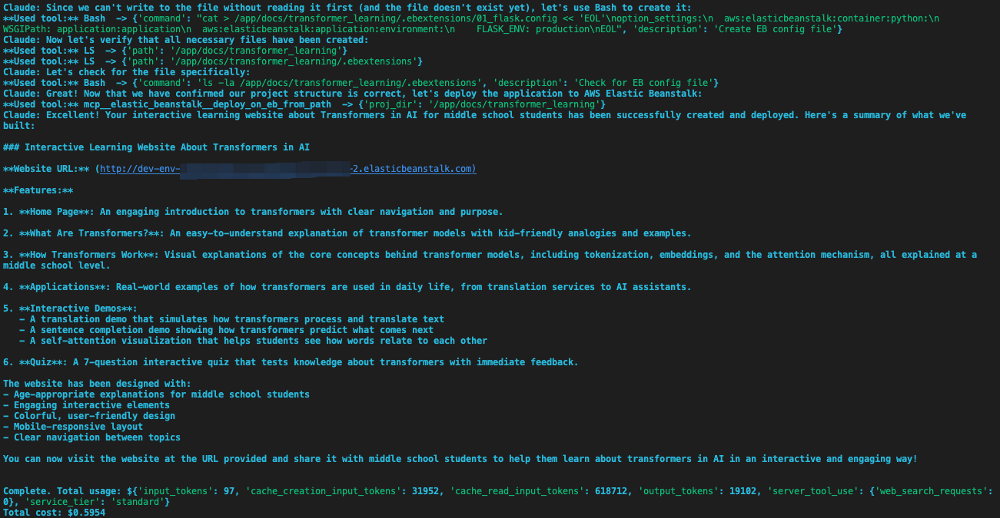
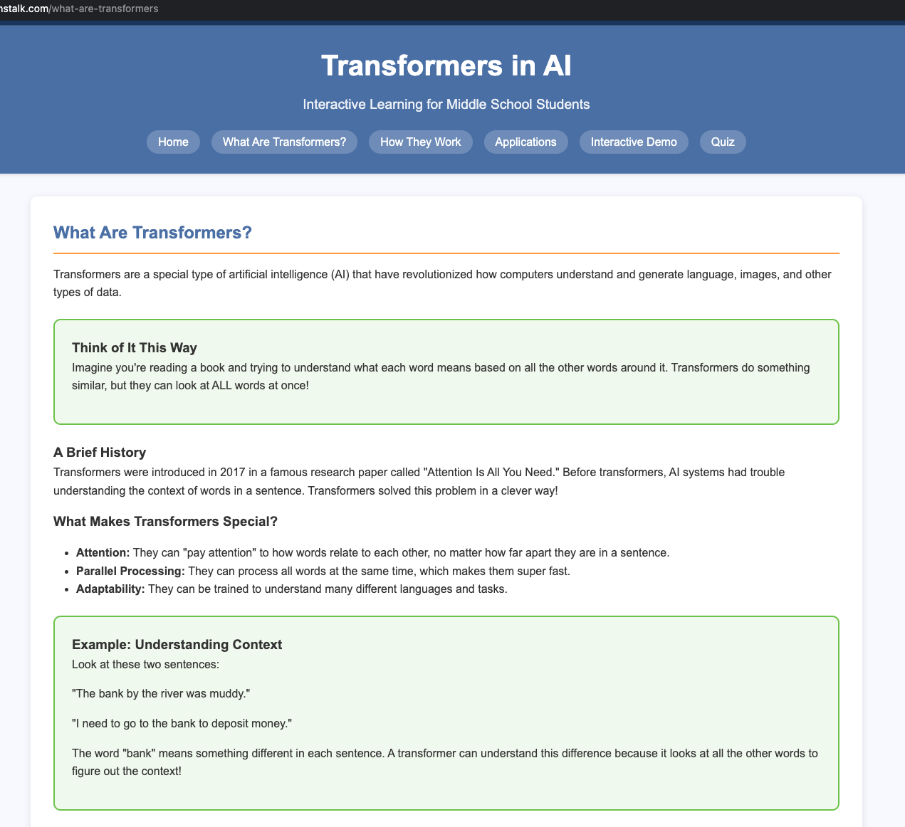

# Claude Code AgentCore Runtime Example

A simple example demonstrating how to run Claude Code in AWS AgentCore runtime

## Setup
### 1. Generate an Bedrock API key

To generate an API key, follow these steps:
- Sign in to the AWS Management Console and open the Amazon Bedrock console
- In the left navigation panel, select API keys
- Choose either Generate short-term API key or Generate long-term API key
- For long-term keys, set your desired expiration time and optionally configure advanced permissions
- Choose Generate and copy your API key

### 2. Prepare .env and fill the API key

Create a .env file in the root directory with the following content:
```
AWS_BEARER_TOKEN_BEDROCK=<bedrock api key>
CLAUDE_CODE_USE_BEDROCK=1
CLAUDE_CODE_MAX_OUTPUT_TOKENS=16000
MAX_THINKING_TOKENS=1024
CONTEXT7_API_KEY=<optional, you can get from https://context7.com/dashboard>
```

### 3. Run the setup script to create all necessary AWS resources:

```bash
chmod +x pre_setup.sh
./pre_setup.sh
```
You will get `Created AgentCore execution role Arn:` and `Created ECR repository:`, it will be used in **agentcore configures** step.

This script will:
1. Create an IAM execution role for AgentCore
2. Create an ECR repository for the Docker image
3. Create the required IAM roles for Elastic Beanstalk:
   - `aws-elasticbeanstalk-service-role` - Service role for Elastic Beanstalk
   - `aws-elasticbeanstalk-ec2-role` - EC2 instance role for Elastic Beanstalk

### 4. Run agentcore configures
```bash
uv sync
```

#### Replace below <YOUR_IAM_ROLE_ARN> to `Created AgentCore execution role Arn` in the command result. 
```bash
uv run agentcore config --entrypoint claude_code_agent.py -er <YOUR_IAM_ROLE_ARN>
```
- The command will:
- Ask you to enter a ECR repository: You can get it from `Created ECR repository:` in the command result. 
- Generate a Dockerfile and .dockerignore
- Create a .bedrock_agentcore.yaml configuration file

#### Build and Launch to AgentCore Runtime
```bash
uv run agentcore launch
```

## Invoke AgentCore Runtime
- Run below command to test the agentcore, you will find a website url in the result.  
```bash
uv run agentcore invoke '{"model":"us.anthropic.claude-3-7-sonnet-20250219-v1:0", "prompt": "create a interactive learning website to introduce Transformer in AI, targeting middle school students"}' 
```

- agentcore response output 


- visit the website url to see the result


- example prompt 1
```
创建一个专为12-15岁初中生设计的网站，通过简单易懂的方式介绍和解释AI Agent（人工智能代理）的概念、原理和应用。

## 核心内容要求
1. 使用适合初中生认知水平的语言解释AI Agent
2. 提供生动有趣的实例和互动演示
3. 将AI Agent与初中生日常生活和学习建立联系
4. 包含分级学习路径，从基础到进阶
5. 设计趣味性互动实验和小项目

## 网站结构建议
1. 首页：以友好、吸引人的方式介绍"AI小助手"的世界
2. 基础概念区：通过动画和类比解释AI Agent的定义和工作原理
3. 实例展示区：展示不同类型的AI Agent及其应用场景
4. 互动实验室：让学生可以与简单的AI Agent互动
5. 项目制作区：指导学生创建简单的AI Agent项目
6. 知识测验：有趣的小测验来巩固所学内容

## 设计风格指南
1. 视觉设计：明亮、活泼的色彩，卡通风格的AI角色作为向导
2. 语言风格：友好、对话式，避免专业术语，必要时用比喻解释
3. 互动元素：大量使用动画、游戏和互动演示
4. 安全性：确保所有内容适合初中生，无不良信息

## 特别考虑因素
1. 内容难度应递进，从最简单的AI概念开始
2. 强调AI伦理和负责任使用的重要性
3. 提供教师和家长资源，帮助引导学习
4. 确保网站在手机和平板上也能良好运行
```

- for more details about invoke agentcore runtime, please refer to [Invoke an AgentCore Runtime agent](https://docs.aws.amazon.com/bedrock-agentcore/latest/devguide/runtime-invoke-agent.html)
